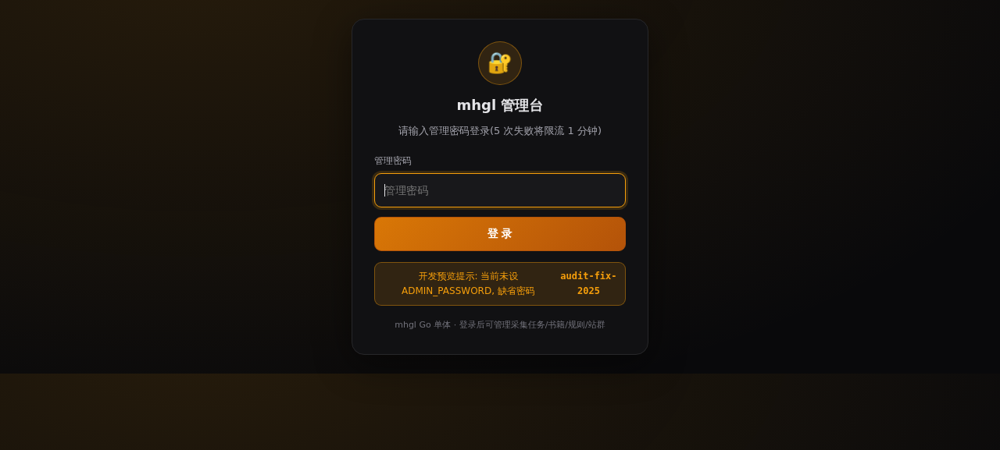
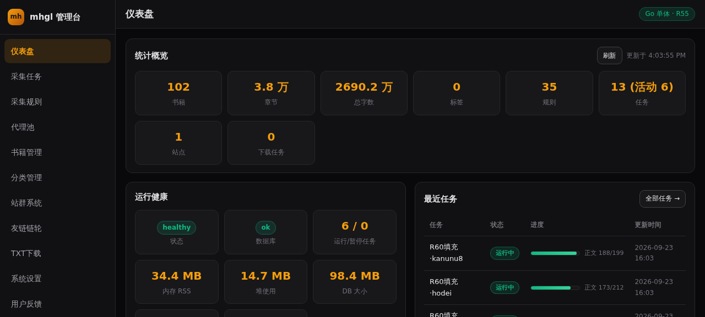
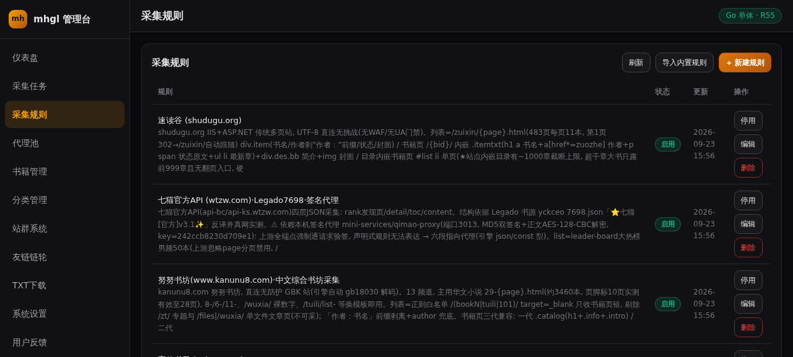
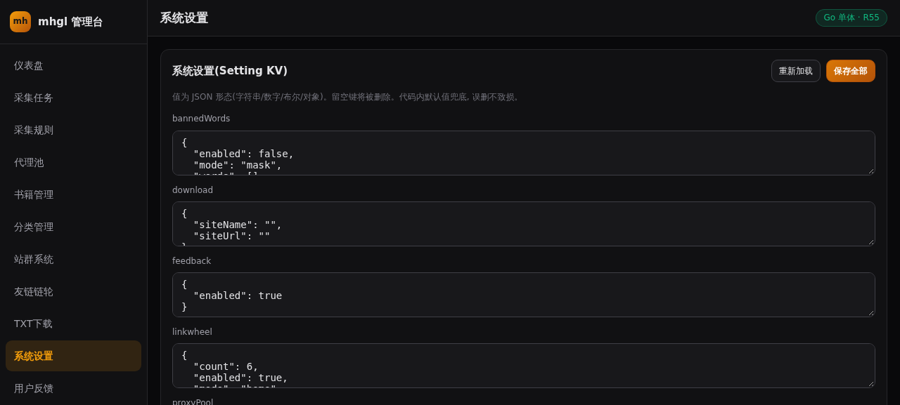
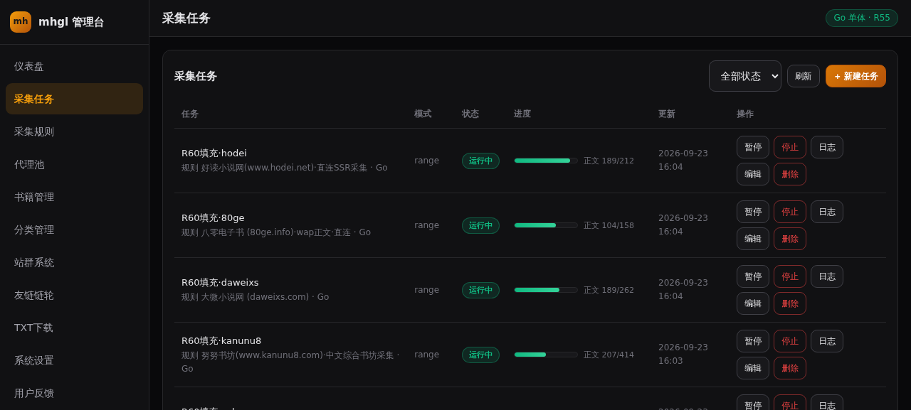
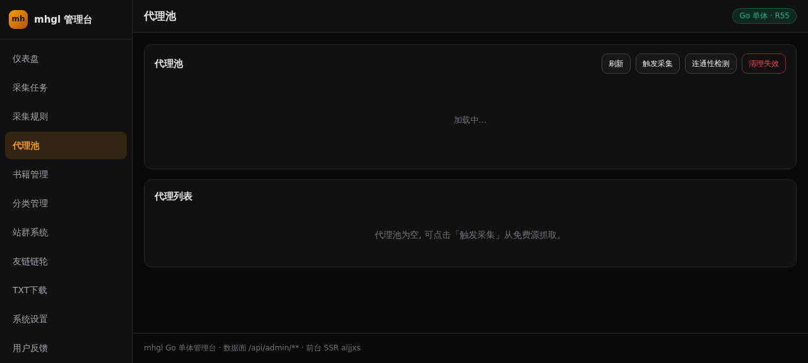

# mhgl 小说聚合站 · 安装部署图文教程（Go 单体版）

> 适用版本：R55 起（全栈 Golang 单体）· 更新：R60
> 架构一句话：**一个 Go 二进制**（`.build/mhgl`）承载 Web 前台/管理后台/REST API/采集引擎/调度器，监听 `:3000`，数据落 SQLite 单文件。Node.js / Next.js 已退役，不再需要。
>
> 全程约 15~30 分钟（取决于网络）。每一步都给出了「预期结果」，与预期不符请直接跳到 §12 常见问题。

---

## 目录

1. [环境要求](#1-环境要求)
2. [获取源码](#2-获取源码)
3. [安装 Go 工具链](#3-安装-go-工具链)
4. [（可选）安装 bun](#4-可选安装-bun)
5. [构建二进制](#5-构建二进制)
6. [初始化数据库](#6-初始化数据库)
7. [启动服务](#7-启动服务)
8. [前台验证](#8-前台验证)
9. [管理后台](#9-管理后台)
10. [创建采集任务](#10-创建采集任务)
11. [代理池（反反爬）](#11-代理池反反爬)
12. [常见问题 FAQ](#12-常见问题-faq)
13. [备份 / 恢复 / 升级](#13-备份--恢复--升级)
14. [主题切换与反馈开关](#14-主题切换与反馈开关)

---

## 1. 环境要求

| 项目 | 最低 | 推荐 |
|---|---|---|
| 操作系统 | Linux x86_64 / arm64（Ubuntu 20.04+、Debian 11+ 均验证） | 同左 |
| 内存 | 512MB（`GOMEMLIMIT` 已内建 600MiB 软上限） | 1GB+ |
| 磁盘 | 500MB（含工具链；正文库按采集量增长，万章 ≈ 数百 MB） | 2GB+ |
| Go | 1.24+（本仓库自带 `scripts/install-go.sh` 一键安装 1.26） | 1.26 |
| bun | **可选**，仅初始化引导脚本用（§6） | 有则更省事 |
| 网络 | 能访问 GitHub（装 Go/拉代码）与目标采集源站 | — |

不需要安装：Node.js、Nginx、MySQL、Redis。全部不需要。

---

## 2. 获取源码

```bash
git clone https://github.com/u4399com-beep/mhgl.git
cd mhgl
```

预期：目录下可见 `cmd/`、`internal/`、`web/`、`scripts/`、`package.json`。
`src/` 是 TS 时代历史资产（仅作主题复刻视觉参考），**不参与构建**，可忽略。

---

## 3. 安装 Go 工具链

### 方式 A：一键脚本（推荐）

```bash
bash scripts/install-go.sh
```

脚本会把 Go 1.26 安装到 `~/go-sdk/go`，**不污染系统目录**，无需 sudo。

### 方式 B：手动安装

```bash
# 以 amd64 为例；arm64 将文件名/目录名中的 amd64 换成 arm64
curl -LO https://go.dev/dl/go1.26.0.linux-amd64.tar.gz
mkdir -p ~/go-sdk && tar -C ~/go-sdk -xzf go1.26.0.linux-amd64.tar.gz
```

### 让 PATH 生效（两种方式任选其一）

```bash
# 临时（当前终端有效）—— 本仓库所有 go 命令都需要
export PATH=$HOME/go-sdk/go/bin:$PATH

# 永久（写入 shell 配置）
echo 'export PATH=$HOME/go-sdk/go/bin:$PATH' >> ~/.bashrc && source ~/.bashrc
```

**验证：**

```bash
go version
# 预期输出：go version go1.26.0 linux/amd64
```

> 注：`package.json` 的 `dev` 脚本（`scripts/dev-go.sh`）会自动把 `~/go-sdk/go/bin` 加入 PATH，日常启动无需手动 export；只有你**直接敲 go 命令**（构建/测试）时才需要。

---

## 4. （可选）安装 bun

bun 仅用于运行初始化引导脚本 `scripts/bootstrap-db.ts`（§6）与个别维护脚本。不用引导功能可以跳过本节。

```bash
curl -fsSL https://bun.sh/install | bash
# 重开终端或 source ~/.bashrc 后验证
bun --version
```

---

## 5. 构建二进制

### 方式 A：自动构建（推荐）

```bash
bun run build
# 等价于: go build -o .build/mhgl ./cmd/server
```

### 方式 B：手动构建

```bash
export PATH=$HOME/go-sdk/go/bin:$PATH
go build -o .build/mhgl ./cmd/server
```

### 方式 C：什么都不做

`scripts/dev-go.sh` 启动时会**自动检测**：源码比二进制新 → 自动增量重建。首次运行会自动触发构建。

**验证：**

```bash
ls -lh .build/mhgl
# 预期: 约 23MB 的单个可执行文件
```

> 提示：国内网络首次构建若下载依赖慢，可设置模块代理：
> `go env -w GOPROXY=https://goproxy.cn,direct`

### 跑一遍门禁（可选但建议）

```bash
go vet ./...                 # 静态检查, 预期无输出
go test -count=1 ./internal/...   # 13 个包全绿
```

---

## 6. 初始化数据库

数据库是 **SQLite 单文件 `db/custom.db`**，首次启动时 Go 服务会**自动建表**（含索引），无需手动执行任何 SQL。

### 6.1 空库起步（全新部署）

空库直接启动也能跑（前台显示暂无书籍），但**强烈建议**执行引导脚本一键铺好运营基线：

```bash
# 前置: 服务已在运行(见 §7), 然后执行:
bun run bootstrap
```

脚本做 4 件事（全部幂等，重复执行安全）：

1. 导入 **35 条内置采集规则**（覆盖 30+ 源站：笔趣阁家族/杰奇 CMS/GBK 站/JSON API 站/CF 防护站等）
2. 创建**默认站点**（localhost:3000，aijjxs 主题）
3. 创建**三大部头批量任务**（神马小说/仙侠天恋/新笔趣阁，不启动）
4. 输出以上资源 ID

**预期输出：**

```
[bootstrap] rules imported ok=35 err=0
[bootstrap] default site created: ok
[bootstrap] task created: 神马小说·大部头批量(yueyouxs) ...
[bootstrap] done
```

### 6.2 从备份恢复（迁移部署）

把旧机的 `db/custom.db`（建议连同 `web/covers/` 封面目录）整体拷贝到新机同路径，直接 §7 启动即可，无需引导。

---

## 7. 启动服务

### 方式 A：dev 脚本（推荐，含自动重建）

```bash
bun run dev
# 或直接: bash scripts/dev-go.sh
```

脚本行为：源码有变更自动重建 → 启动 `.build/mhgl` 监听 `:3000` → 日志写 stdout。

### 方式 B：直接运行二进制（生产推荐）

```bash
nohup .build/mhgl >> server.log 2>&1 &
```

### 方式 C：后台常驻（推荐生产）

```bash
( setsid nohup bun run dev > dev.log 2>&1 < /dev/null & )   # 脚本托管
# 或配合 systemd:
#   [Service] WorkingDirectory=/opt/mhgl ExecStart=/opt/mhgl/.build/mhgl Restart=always
```

**自检：**

```bash
curl -s -o /dev/null -w '%{http_code}\n' http://127.0.0.1:3000/
# 预期: 200
```

常用环境变量（都有默认值，通常不用动）：

| 变量 | 默认 | 说明 |
|---|---|---|
| `PORT` | 3000 | 监听端口 |
| `DB_PATH` | `db/custom.db` | SQLite 路径 |
| `MEM_LIMIT_MB` | 600 | Go 内存软上限 |
| `ADMIN_PASSWORD` | 见后台登录页提示 | 管理密码（生产**必改**） |

---

## 8. 前台验证

浏览器打开 `http://服务器IP:3000/`：


核对清单：

- 首页有「最新上传 / 封面推荐 / 小说分类 / 点击榜」面板（无书时显示空态文案，正常）
- 页脚有「管理 / 反馈」链接
- 手机宽度（390px）无横向滚动
- 分类导航为 4 字锚（玄幻奇幻/都市生活/现代言情/…），点击进入分类列表页

---

## 9. 管理后台

### 9.1 登录

入口 1：任意页面页脚「管理」；入口 2：直达 `http://服务器IP:3000/admin`。



输入管理密码（缺省密码见登录页提示文案；生产环境**第一时间在系统设置里修改**）。

### 9.2 仪表盘



左侧导航一览：仪表盘 / 采集任务 / 采集规则 / 代理池 / 书籍管理 / 分类管理 / 站群系统 / 友链链轮 / TXT下载 / 系统设置 / 用户反馈 / 数据备份。

### 9.3 采集规则



每条规则包含 list（列表页）/ book（书籍页）/ toc（目录页）/ content（正文页）四段选择器 + fetch（反反爬参数）+ clean（噪声清洗）。支持手动新建、批删、内置库重导入。

### 9.4 用户反馈


前台读者在 `/feedback` 页提交（带开关与限频），后台可按状态筛选、标记已处理、删除。

### 9.5 系统设置



含智能 PSEO 自动生成开关、TDK/SEO 模板、违禁词、伪静态、代理池策略、**反馈开关**等。

---

## 10. 创建采集任务

路径：后台 → 采集任务 → 新建。



三种模式：

| 模式 | 填什么 | 典型用途 |
|---|---|---|
| `single` | 一本书的 URL | 补采/重采单本 |
| `bookIds` | 书号列表或 from/to 范围 | 按源站书号段批量 |
| `range` | 列表页 URL 模板（`{page}` 自动替换）+ listStart/listEnd | 按列表页翻页扫站 |

关键参数（引擎已内建防抖钳制）：

- **线程** threadMin/threadMax：并发章节抓取数（≤20/批）
- **间隔** intervalMin/intervalMax（ms）：批间随机休眠——对反爬敏感的站从 800~2000 起步
- **engine**：`go`（唯一引擎，Node 已退役）

点击「启动」后状态变为 running，列表页实时刷新进度（书数/章数/失败数）。暂停/停止/恢复用行内控制按钮。

**验收建议**：先拿一条直连规则（如「好读小说网」「速读谷」）起 `range` 任务 listStart=listEnd=1 试水，确认出书、出章节、正文干净后再放量。

---

## 11. 代理池（反反爬）

路径：后台 → 代理池。



- **收割**：12 个公开代理源自动抓取入库（去重幂等）
- **校验**：并发探针实测连通性（http/https/socks4/socks5，含 socks4a 自实现握手）
- **周期化**：服务启动即常驻（缺省 6h 收割 + 30min 校验，可用 `PROXY_HARVEST_INTERVAL` 覆盖）
- **消费**：采集引擎启动即按健康分拉 Top64 免费池，与规则自带代理合并；使用事实回写健康分（成功 +1，连败 -5，探针全量重算）
- **清理**：`DELETE /api/admin/proxy-pool?action=clean` 两段式（先预览数量再 confirm），或直接清空

系统设置 → proxyPool：`auto`（自动喂给采集）、`checkBatch`、`intervalMin`、`pickLimit`。

---

## 12. 常见问题 FAQ

**Q1：端口 3000 被占用？**
`PORT=3100 bun run dev` 换端口；或 `ss -ltnp | grep 3000` 找到占用进程处理。

**Q2：首次启动等了很久没响应？**
模块缓存被清后首次构建需拉取依赖（约 60s），属正常。`tail -f dev.log` 观察进度。

**Q3：后台登录密码忘了？**
启动时带 `ADMIN_PASSWORD=新密码` 重启即可覆盖；或看登录页提示的缺省密码。

**Q4：某站采集 403/412/503？**
该站有反爬。按序尝试：调大任务间隔 → 给规则 fetch 配置代理（needsProxy 池）→ 镜像域名。CF 指纹级防护（JA3）当前靠探针+代理+UA 仿真硬扛，不强求全通。

**Q5：正文有乱码？**
GBK 站已自动探测（GB18030 兜底）。若个别站异常，检查规则 fetch 编码相关配置后重采。

**Q6：封面图不显示？**
封面本地化存于 `web/covers/`，服务端 `/api/public/cover` 出图。列表封面空缺 = 源站本无图（占位符回落）。批量修封面见后台「书籍管理」。

**Q7：数据库锁死 / database is locked？**
服务对主库单连接写（maxConns=1）。**永远不要**在服务运行时用第三方工具直接写 `db/custom.db`；备份用后台「数据备份」导出。

**Q8：想清空重来？**
停服 → 删除 `db/custom.db` → 启动（自动建表）→ `bun run bootstrap` 引导。

---

## 13. 备份 / 恢复 / 升级

**备份**：后台 → 数据备份 → 导出（JSON 全量含书籍/章节/规则/设置，支持分卷）。建议每周例行 + 大改动前手动。

**恢复**：后台 → 数据备份 → 上传导入。策略可选 overwrite（覆盖）/ skip（跳过已存在）；任务自动转 paused 防冲突。

**升级**（拉新代码）：

```bash
git pull
bun run build          # 或让 dev-go.sh 自动重建
kill -TERM $(pgrep -f '.build/mhgl') && bun run dev   # 优雅停 → 启动
```

启动时 `recoverOnBoot` 会把中断的 running 任务安全转为 paused，进后台手动「启动」即可续采（增量模式不重复抓已有章节）。

**回滚**：保留旧二进制副本（`.build/mhgl.bak`），回滚 = 恢复二进制 + 恢复备份 DB。

---

## 14. 主题切换与反馈开关

**主题切换**：后台 → 站群系统 → 编辑站点 → `themeId` 填主题目录名。
当前内置 11 套主题（1:1 复刻自各源站视觉）：

| themeId | 风格 |
|---|---|
| `aijjxs`（缺省） | 久久小说：白底蓝头，封面推荐+分类 4 组 |
| `pili` | 霹雳书屋：米色纸感，强档推荐大图 |
| `shipsay` | 书萨：粉红 hover，六分类块 |
| `x2552` | 黑冰模板：紧凑蓝链，公告条 |
| `kks101` | 快看小说：灰底卡片 |
| `trxsw` | 同人小说网：杰奇天蓝 |
| `ddyueshu` | biquge 灰调，novelslist 六块 |
| `ggd66` / `huangjinwu` / `qb23` / `x33yq` | 各源站对应风格 |

自定义主题：复制任一 `internal/web/tpl/themes/{id}/` 目录改名，改模板与 `web/static/css/{id}.css`，`themeId` 填新目录名即可（注意 normalizeTheme 白名单与 sw.js 预缓存清单）。

**反馈开关**：后台 → 系统设置 → feedback → `enabled` 开/关（`PUT /api/admin/settings`，body `{"feedback":{"enabled":false}}`）。关闭后前台 `/feedback` 显示未开放态，POST 直接 403。

---

## 附：一分钟极简清单

```bash
git clone https://github.com/u4399com-beep/mhgl.git && cd mhgl
bash scripts/install-go.sh && export PATH=$HOME/go-sdk/go/bin:$PATH
bun run build && bun run dev &          # 构建并启动(:3000)
bun run bootstrap                        # 铺 35 规则+默认站点+任务
curl -s http://127.0.0.1:3000/ -o /dev/null -w '%{http_code}\n'   # 200 即成
# 后台: http://IP:3000/admin （缺省密码见登录页提示）
```
