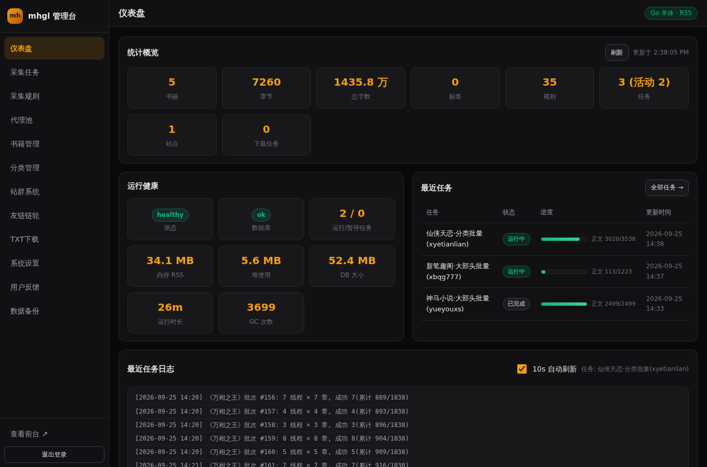
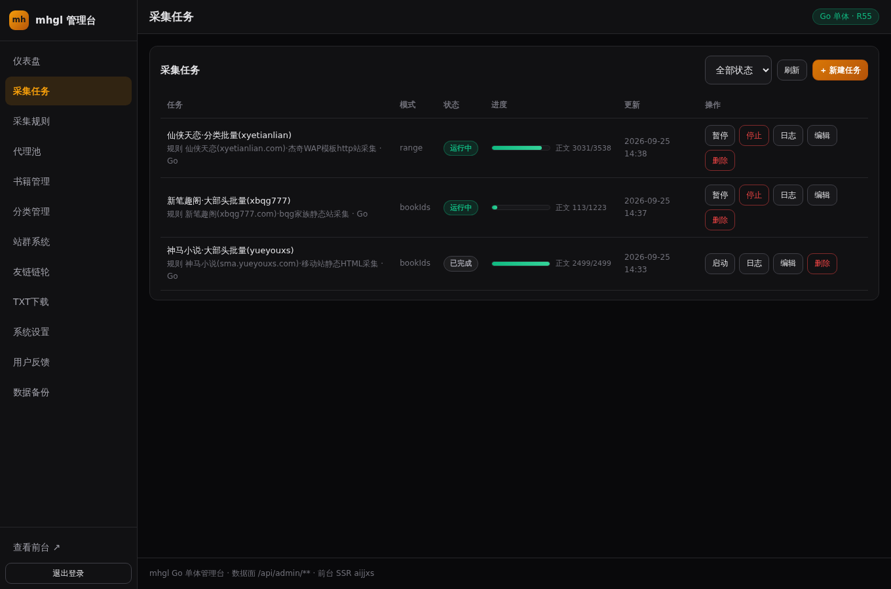

# mhgl 小说聚合站 · 安装部署图文教程（纯 Go 单体版 · R69 全重写）

> 适用版本：R69 起（纯 Go 单体）· 本版更新：**R69**（面向从零部署者逐细节重写；建库/引导全面 Go 原生化）· **R70 增补**：§6.6 内容伪装 / 反搜索与分卷显示设置 · **R71 增补**：§1.4/§2.2/§2.3/§4.1/§5 沙箱平台引导链 `.zscripts` 纯 Go 化收尾口径
> 架构一句话：**一个 Go 二进制**（`.build/mhgl`）承载 Web 前台 / 管理后台 / REST API / 采集引擎 / 调度器，监听 `:3000`，数据落 SQLite 单文件 `db/custom.db`。数据库建表与运营数据播种由服务**原生自举**（启动幂等建表 + 空库自动播种），Node.js / Next.js / Prisma / Docker / MySQL / Redis 全部不需要。
>
> 全程约 10~20 分钟（大头是首次构建与模块下载，取决于网络）。每步都给出「预期结果」，与预期不符直接跳 **§9 常见问题排查**；**部署完成站点「预览挂掉」时直接跳 §7 一键恢复**。

---

## 目录

1. [前置条件（系统 / git / Go）](#1-前置条件)
2. [获取代码与目录认识](#2-获取代码)
3. [数据库初始化（原生自举：自动建表 + 自动播种）](#3-数据库初始化)
4. [启动服务（三种形态 + 生产常驻 + 加固清单）](#4-启动服务)
5. [看门狗（进程死了 15 秒自动拉起）](#5-看门狗)
6. [管理后台（登录 / 建任务 / 代理池 / 主题 / 内容伪装）](#6-管理后台)
7. [recover.sh 一键恢复（预览挂掉的工程化兜底）](#7-recover-sh-一键恢复)
8. [数据备份（WAL 感知 + 三类三机制）](#8-数据备份)
9. [常见问题排查 FAQ](#9-常见问题排查-faq)
10. [附：一分钟极简清单](#附一分钟极简清单)

---

## 1. 前置条件

### 1.1 操作系统 / 内存 / 磁盘 / 网络

| 项目 | 最低 | 推荐 | 说明 |
|---|---|---|---|
| 操作系统 | Linux x86_64 / arm64（Ubuntu 20.04+、Debian 11+ 已验证） | 同左 | 裸机直跑，无需容器 |
| 内存 | 512MB | 1GB+ | Go 侧 `GOMEMLIMIT` 内建 600MiB 软上限（`MEM_LIMIT_MB` 可调）；采集开大线程时吃内存的是宿主而非引擎 |
| 磁盘 | 500MB（工具链 + 空库） | 2GB+ | 正文库按采集量增长，万章 ≈ 数百 MB；Go 工具链占 ~250MB |
| 网络 | 能访问 GitHub（拉代码）+ Go 官方下载源（装 Go，不可达自动回退 golang.google.cn 镜像）+ 目标采集源站 | — | 首次构建还需拉 Go 模块（国内可换 goproxy.cn，见 §4.2） |

### 1.2 git

拉代码用。绝大多数发行版自带；没有就装：

```bash
# Debian/Ubuntu
sudo apt-get install -y git
git --version        # 预期: git version 2.x.x
```

### 1.3 安装 Go（唯一硬前置）

本项目需要 **Go 1.26 级别工具链**（`go.mod` 声明 `go 1.26.0`）。

#### 方式 A：一键脚本（推荐）

```bash
cd /path/to/mhgl          # 若尚未拉代码, 先看 §2 再回来执行也行
bash scripts/install-go.sh
```

脚本行为（**幂等**，重复执行安全；不污染系统目录、无需 sudo）：

1. 把 Go 工具链解压到 `~/go-sdk/go`（go.dev 不可达时自动回退 golang.google.cn 镜像）；
2. 打印版本号并提示完成。

预期输出：

```
go version go1.26.x linux/amd64
[install-go] 完成。dev-go.sh/recover.sh 会自动把 /home/you/go-sdk/go/bin 加入 PATH(dev-go.sh 检测到 go 缺失时也会自动调本脚本)
```

#### 方式 B：手动安装

```bash
# amd64 示例; arm64 把文件名/目录名里的 amd64 换成 arm64; 版本以 go.mod 声明为准
curl -LO https://go.dev/dl/go1.26.0.linux-amd64.tar.gz
mkdir -p ~/go-sdk && tar -C ~/go-sdk -xzf go1.26.0.linux-amd64.tar.gz
```

#### 让 PATH 生效（两种方式任选）

```bash
# 临时（当前终端有效）
export PATH=$HOME/go-sdk/go/bin:$PATH

# 永久（写入 shell 配置）
echo 'export PATH=$HOME/go-sdk/go/bin:$PATH' >> ~/.bashrc && source ~/.bashrc
```

**验证：**

```bash
cd /path/to/mhgl        # 项目内
go version
# 预期输出: go version go1.26.0 linux/amd64（或更高）
```

> **版本小注**：若你本机装的是更低的 Go 版本且 `GOTOOLCHAIN=auto`（默认开启）未被禁用，在项目目录内首次执行 go 命令时会自动下载 go1.26.0 工具链补齐——首次构建多花一点时间属正常。
> **日常启动其实不用手动 export**：`scripts/dev-go.sh` 每次启动都会自动把 `~/go-sdk/go/bin` 加进 PATH，而且 **go 缺失时它会自动调 `scripts/install-go.sh` 自愈安装**（见 §4.1）。只有你直接敲 `go build` / `go test` 等命令时才需要先 export。

### 1.4 不再需要安装的东西（历史注）

- **bun / Node.js / Prisma CLI**：❌ 不需要。原 TS/Prisma 引导链（`bunx prisma db push` 建表 + TS 空库引导脚本 `bootstrap-db.ts`）已于 **R69 全量退役**——建库建表与运营数据播种全部内化进 Go 二进制（§3）。`bun run dev` 只是 package.json 的零依赖别名壳（等价 `bash scripts/dev-go.sh`），即使装了 bun 它也不会执行任何 JS；沙箱平台引导链 `.zscripts/dev.sh` 亦已于 **R71 纯 Go 化**（去 bun 依赖，逐件说明见 `.zscripts/README.md`）。
- **Docker / MySQL / Redis / Nginx（可选）**：❌ 都不需要。数据库就是仓库内 SQLite 文件；Docker 链已归档 `docs/archive/docker/`。

---

## 2. 获取代码

### 2.1 clone 仓库

```bash
git clone https://github.com/u4399com-beep/mhgl.git
cd mhgl
```

> 仓库地址以 `git remote -v` 输出为准（本教程与仓库 origin 一致）。

### 2.2 目录结构（每个目录是什么）

```
mhgl/
├── cmd/server/            # Go 装配入口: config → bootstrap(自举) → store(SQLite) → 恢复 → 采集管理器 → HTTP
│                          #   另含 `mhgl bootstrap` 子命令(§3.3)
├── internal/              # 全部业务代码(Go):
│   ├── store/             #   SQLite 直连数据层(单写者 WAL)
│   ├── bootstrap/         #   原生自举: 幂等建表(14 表 DDL) + 空库播种(规则/分类/站点/任务)
│   ├── crawl/             #   采集引擎(反反爬/解析/清洗/编排/调度, 内置于主二进制)
│   ├── api/               #   /api/admin/** + /api/public/** JSON 接口
│   │   └── builtin_rules.json  # 内置规则库(35 条实测规则, go:embed, 播种与后台「一键导入」数据源)
│   ├── web/               #   前台 SSR(11 套主题, 模板 go:embed 内嵌二进制) + 后台管理模板
│   ├── stealth/           #   内容伪装渲染管线(R70: 混淆/转码/干扰句/伪原创, 公共 HTML 出口, 默认全关)
│   ├── auth/              #   HMAC Cookie 鉴权
│   ├── config/            #   环境变量配置
│   └── sanitize/          #   展示级 HTML 消毒
├── web/
│   ├── covers/            # 封面图落盘目录(COVER_DIR 可覆盖; 随 git 回来, 见 §8)
│   └── static/            # 前台/后台静态源文件(css/js, 磁盘直服, 改完即时生效)
├── db/                    # SQLite 运行时数据(custom.db + -wal/-shm, 不入库, ★备份它; 缺失服务自建)
├── download/  upload/     # TXT 下载产物 / 上传暂存
├── scripts/               # 运维脚本: install-go.sh / dev-go.sh / dev-watchdog.sh / recover.sh
├── .zscripts/             # 沙箱平台引导/部署脚本族(R71 纯 Go 化对齐: dev.sh/start.sh/build.sh 等, 逐件说明见其 README.md)
├── docs/                  # 本教程 / 规则手册 / 历史归档
├── package.json           # 零依赖纯别名壳(平台启动接口而非 JS 依赖): "dev"=bash scripts/dev-go.sh, 另有 build/start/lint; 仓库无任何 Node/TS 源码
└── .env.example           # 环境变量样例(注释齐全, 复制为 .env 使用)
```

### 2.3 配置环境变量

```bash
cp .env.example .env
```

`.env.example` 每项带中文注释。第一次部署**只需关心一项**：

```bash
# ===== 后台鉴权 =====
ADMIN_PASSWORD=audit-fix-2025     # 生产环境务必改成强密码!(改完重启服务生效)
```

> ⚠️ **注入口径（重要）**：Go 二进制**直读进程环境变量，不会自己解析 `.env` 文件**。三种注入方式任选：
> ① **shell**：`set -a; source .env; set +a` 后再启动；
> ② **systemd**：`EnvironmentFile=/opt/mhgl/.env`（§4.5，生产推荐）；
> ③ **开发启动链自动注入**：`bash scripts/dev-go.sh`（含平台引导链 `bun run dev` 别名 / `.zscripts/dev.sh` / `.zscripts/start.sh`）会自动 source `.env`（R71 起全链纯 Go 化，不再依赖 bun 的自动加载）。
> 不注入也能跑：全部变量有缺省值（`PORT=3000`、`DB_PATH=db/custom.db`、dev 密码 `audit-fix-2025`）。

其余项用默认值即可。核心变量速览（权威全表见 [DEPLOY.md](../DEPLOY.md) §③，`.env.example` 逐项注释）：`PORT`(3000) / `DB_PATH`(db/custom.db) / `ADMIN_PASSWORD` / `SESSION_SECRET` / `GO_ENV=production` / `COOKIE_SECURE` / `MEM_LIMIT_MB`(600) / `COVER_DIR`(web/covers) / `MHGL_AUTO_SEED`(=0 关播种)。

---

## 3. 数据库初始化

### 3.1 机制：每次启动原生自举（R69 起零外部工具）

- 数据库 = **SQLite 单文件 `db/custom.db`**（位置可用 `DB_PATH` 覆盖）。
- **服务每次启动先做幂等建表**（`internal/bootstrap`）：对 14 张表执行 `CREATE TABLE IF NOT EXISTS`——全新空库直接获得完整 schema，既有库全部空转（毫秒级、零改动）。**建表不再需要任何外部工具**。
- **库文件缺失**（全新部署/被清）：服务自动创建文件与目录 → 建表 → 正常启动，全程无感。
- **库文件损坏**（非 SQLite 内容，罕见）：启动会报错退出（`ensure schema` 失败）——跑一键恢复 `bash scripts/recover.sh`（§7，其 DB 完整性检查会删掉坏文件交给服务自建），或手动 `rm -f db/custom.db db/custom.db-wal db/custom.db-shm` 后重启。

### 3.2 空库自动播种（首次启动后台执行）

光有空表就能跑（前台显示空态），但服务还会在**规则数为 0 时（判定为全新部署）自动播种运营基线**——后台执行，不阻塞服务监听：

| 播种什么 | 数量/内容 | 幂等行为 |
|---|---|---|
| 内置采集规则 | **35 条**实测站点规则（笔趣阁家族/杰奇 CMS/GBK 站/JSON API 站/CF 防护站等） | 按 name 幂等 upsert，保留既有 ruleId |
| 分类 | **16 个**（15 个 4 字主分类 + 兜底分类） | 按名查重跳过 |
| 默认站点 | `localhost:3000`，aijjxs 主题 | 仅 Site 表为空时创建 |
| 大部头采集任务 | 神马小说(yueyouxs)/仙侠天恋(xyetianlian)/新笔趣阁(xbqg777)，engine=go | 按任务名查重；**只创建为 pending，不自动启动** |

预期日志（`dev.log` 或前台终端）：

```
[mhgl] 空库(规则 0 条) → 自动引导运行态(关闭: MHGL_AUTO_SEED=0)
[mhgl] auto-seed done: rules +35/upd0(err=0) categories +16 site=true tasks +3
```

**关闭开关**（纯手动运维，例如你想完全掌控入库节奏）：

```bash
MHGL_AUTO_SEED=0 ./.build/mhgl
```

> 小技巧：先手动 `./.build/mhgl bootstrap`（§3.3）铺好底再正常启动，规则非空后自动播种自然不再触发，效果等同关闭。

### 3.3 显式引导：`./.build/mhgl bootstrap`（CLI 子命令）

不想依赖「启动时机」，想先把库铺好？用内置子命令（**幂等**，重复执行安全）：

```bash
./.build/mhgl bootstrap     # 若还没有二进制, 先 go build -o .build/mhgl ./cmd/server
```

行为：建 schema（同 §3.1 的幂等 DDL）+ 播种（同 §3.2 的四件套）→ **打印报告后退出**。**不需要服务在线、不需要管理员密码、不需要 bun**（直连 SQLite）。预期输出：

```
[bootstrap] done: rules +35/upd0(err=0) categories +16 site=true tasks +3
```

典型场景：生产部署想先铺数据再起服务 / 一键恢复流程第 4 步 / 脚本化初始化。

### 3.4 从备份迁移（老手路径）

把旧机的 `db/custom.db`（建议连同 `web/covers/` 封面目录）整体拷到新机同路径，直接 §4 启动即可——启动自举只补缺失表、不动既有数据；规则非空所以不会触发播种，**跳过 §3.2/§3.3**。备份口径见 §8。

---

## 4. 启动服务

### 4.1 三种启动形态

```bash
# 形态一: 直接运行二进制(项目根目录执行, 相对路径以 cwd 为项目根)
./.build/mhgl

# 形态二: 开发启动器(推荐日常用)——自愈 + 增量构建
bash scripts/dev-go.sh

# 形态三: 平台启动钩子(沙箱平台即用此链拉起项目):
#         .zscripts/dev.sh(R71 纯 Go 化: .env 注入 → 未监听才拉起 dev-go.sh →
#         探活 → .build/mhgl bootstrap 幂等引导 → 健康检查, 见 .zscripts/README.md);
#         `bun run dev` 亦可达同链(package.json "dev" 零依赖别名壳 → 形态二)
bun run dev
```

形态二背后发生的事（逐层核对过）：

```
bash scripts/dev-go.sh
  ├─ ① PATH 前插 ~/go-sdk/go/bin(GO_SDK_BIN 可覆盖), GOMEMLIMIT=${MEM_LIMIT_MB:-600}MiB
  ├─ ② [自愈] go 缺失? → 自动 bash scripts/install-go.sh 后重试
  ├─ ③ 增量构建: cmd/internal/go.mod 的 .go 源、internal/web/tpl 模板与
  │      builtin_rules.json(go:embed 内嵌资产)、web/ 任一文件比
  │      .build/mhgl 新 → go build -o .build/mhgl ./cmd/server
  └─ ④ exec .build/mhgl  →  监听 :3000(启动自举建表; 空库后台自动播种)
```

二进制产物在 **`.build/mhgl`**（单文件，~23MB；模板已内嵌）。源码没改时③跳过，秒级启动。

### 4.2 首次构建耗时预期

| 场景 | 预期耗时 |
|---|---|
| 首次构建（拉 Go 模块 + 可能自动下载 go1.26 工具链） | **1~3 分钟**，日志停在 `[dev-go] building…` 属正常 |
| 日常启动（二进制已缓存，源码无变更） | <1s（直接 exec） |
| 改了源码后启动 | 增量重建 10~60s |

> 国内网络模块拉取慢：`go env -w GOPROXY=https://goproxy.cn,direct`（一次性）。

### 4.3 验证启动成功

```bash
curl -s -o /dev/null -w '%{http_code}\n' http://127.0.0.1:3000/
# 预期: 200

curl -s http://127.0.0.1:3000/healthz
# 预期: {"ok":true,"app":"mhgl","engine":"go","rssMB":...,"uptimeMs":...}
```

浏览器打开前台（书城/阅读/搜索）：


核对清单：首页有「最新上传 / 封面推荐 / 小说分类」面板（空库显示空态文案，正常）；页脚有「管理 / 反馈」链接；分类导航为 4 字锚。此时后台已可直接登录（§6.1）——播种已替你导好了 35 条规则与分类，直接去 §6.3 建任务/启动任务即可。

### 4.4 联调覆盖（PORT / DB_PATH / 内存）

```bash
PORT=3040 DB_PATH=db/go-test.db ./.build/mhgl        # 独立端口+独立库(目录不存在会自动创建)
MEM_LIMIT_MB=1024 ./.build/mhgl                      # 调大 Go 内存软顶
# (dev-go.sh 同样支持这三个变量前缀覆盖)
```

### 4.5 后台常驻（生产推荐）

```bash
# 形态一: nohup/setsid(脚本托管)
( set -a; source .env; set +a; setsid nohup ./.build/mhgl > mhgl.log 2>&1 < /dev/null & )

# 形态二: systemd(推荐)
```

systemd 单元 `/etc/systemd/system/mhgl.service`：

```ini
[Unit]
Description=mhgl novel aggregation (Go monolith)
After=network.target

[Service]
WorkingDirectory=/opt/mhgl
EnvironmentFile=/opt/mhgl/.env
ExecStart=/opt/mhgl/.build/mhgl
Restart=on-failure
RestartSec=5
User=www-data
NoNewPrivileges=true

[Install]
WantedBy=multi-user.target
```

```bash
# 首次: 构建好二进制再启用
cd /opt/mhgl && bash scripts/install-go.sh && export PATH=$HOME/go-sdk/go/bin:$PATH
go build -o .build/mhgl ./cmd/server
systemctl enable --now mhgl && systemctl status mhgl
```

> systemd 要点：`WorkingDirectory` 必须是项目根（`db/`、`web/static`、`web/covers` 按相对路径解析）；环境变量经 `EnvironmentFile` 注入；升级 = `git pull && go build` 后 `systemctl restart mhgl`。

### 4.6 生产 HTTPS / Secure Cookie

会话 Cookie（`heis_admin`）默认 `HttpOnly + SameSite=Lax`、不带 `Secure`（保 http 直连可用）。生产 https：

- **反代终结 TLS（推荐）**：反代透传 `X-Forwarded-Proto: https` 即自动附加 `Secure`，零配置。Caddy `reverse_proxy 127.0.0.1:3000` 默认透传；Nginx 需 `proxy_set_header X-Forwarded-Proto $scheme;`。仓库根自带 `Caddyfile`（`:81 → :3000`）可参考。
- **显式开关**：`COOKIE_SECURE=1` 强制所有登录/注销报文带 `Secure`（http 站点不要开，浏览器会拒收导致后台登不上）。

### 4.7 生产加固清单（上线前逐项打勾）

| 项 | 怎么做 |
|---|---|
| 后台强密码 | `.env`/环境设 `ADMIN_PASSWORD`（生产留空 = 登录恒失败，fail-closed） |
| 会话密钥 | `SESSION_SECRET=$(openssl rand -hex 32)`（生产留空同样 fail-closed） |
| 生产口径 | `GO_ENV=production` |
| https | 反代 TLS + `X-Forwarded-Proto` 透传（或 `COOKIE_SECURE=1`） |
| 自动播种取舍 | 默认开；纯手动运维设 `MHGL_AUTO_SEED=0` |
| 例行备份 | §8（WAL 感知，`sqlite3 .backup` 或停服拷贝） |

---

## 5. 看门狗

`scripts/dev-watchdog.sh`：每 **15s** 探测一次 3000 端口，**死了就自动拉起**（5s 冷却），日志追加到拉起方指定的文件。它解决的是 **OOM** 类死亡——宿主内存被打爆杀掉服务进程（数据不丢，重启安全，启动恢复机制会把中断任务收编为 paused）。沙箱平台目录的同名件 `.zscripts/dev-watchdog.sh` 已于 R71 改为直接委托本脚本（旧分叉版含 `bun run dev` 依赖，随 R71 去 bun 化退役）。

```bash
# 手动拉起(recover.sh 第 5 步就是这条):
( setsid nohup bash scripts/dev-watchdog.sh > /tmp/watchdog.log 2>&1 < /dev/null & )
pgrep -f dev-watchdog.sh    # 预期: 打印一个 pid
```

| 文件 | 内容 |
|---|---|
| `/tmp/watchdog.log` | 看门狗自身日志（`port 3000 dead, restarting...` 字样=触发过拉起） |
| `/tmp/main-dev-restart.log` | 被拉起服务的输出 |
| `dev.log` | recover.sh 形态拉起的服务输出 |

> 注意：看门狗脚本内 `cd /home/z/my-project` 是本仓库开发沙箱的路径，**自建部署请把该行改成本机项目路径**，或用 systemd 的 `Restart=on-failure` 替代它（生产推荐）。

---

## 6. 管理后台

### 6.1 登录

- 入口 1：任意页面页脚「管理」；入口 2：直达 `http://服务器IP:3000/admin`（未登录自动 302 到登录页）。


- 密码：dev/预览模式缺省 **`audit-fix-2025`**（登录页会显示提示并支持一键填入）；环境变量 `ADMIN_PASSWORD=你的密码` 覆盖后**重启生效**；`GO_ENV=production` 且未配置密码时**登录恒失败**（fail-closed，防裸奔）。
- 生产环境登录后第一件事：**改成强密码**（改环境变量重启生效）。

### 6.2 后台导览

登录后进入仪表盘：



左侧导航：仪表盘 / 采集任务 / 采集规则 / 代理池 / 书籍管理 / 分类管理 / 站群系统 / 友链链轮 / TXT下载 / 系统设置 / 用户反馈 / 数据备份。

> §3 的自动播种已替你导入 **35 条规则 + 16 分类 + 默认站点**——进「采集规则」核对即可，不需要再手动「一键导入」（该按钮仍在，幂等覆盖，可恢复出厂）。

### 6.3 建采集任务（或直接用播种自带 3 条）

路径：后台 → **采集任务** → 新建。



> §3.2 的自动播种已自带 **3 条现成任务**（神马小说/仙侠天恋/新笔趣阁，创建为 pending **不自动跑**）——在任务页点「启动」即可开采；下面是自己新建时的字段说明。

三种模式：

| 模式 | 填什么 | 典型用途 |
|---|---|---|
| `single` | 一本书的 URL | 补采/重采单本 |
| `bookIds` | 书号列表（换行/逗号分隔） | 按源站书号批量 |
| `range` | 列表页 URL 模板（`{page}` 占位符）+ listStart/listEnd | 按列表页翻页扫站 |

关键参数（引擎已内建防抖钳制）：

- **线程** threadMin/threadMax：并发章节抓取数（≤20/批）
- **间隔** intervalMin/intervalMax（ms）：批间随机休眠——反爬敏感的站从 800~2000 起步
- **engine**：`go`（唯一引擎）

点「启动」后状态 running，进度实时刷新（书数/章数/失败数）。暂停/停止/恢复用行内控制按钮。

**验收建议**：先拿一条直连规则起 `range` 任务 `listStart=listEnd=1` 试水，确认出书、出章节、正文干净后再放量。

### 6.4 代理池（反反爬，可选）

后台 → 代理池：收割（12 个公开源）/ 校验（并发探针）/ 周期化常驻（缺省 6h 收割 + 30min 校验）/ 消费（引擎按健康分取 Top64 免费池）。规则级出口代理在「采集规则 → fetch → 代理」配置（http/socks5h 逗号分隔轮换）。系统设置 → `proxyPool` 可开关自动喂给采集。

> 历史注（R69）：原 mini-services 外置签名/解密代理（端口 3010~3017）已整体退役，采集引擎直连采集，无需任何伴生进程。

### 6.5 主题切换（可选）

后台 → 站群系统 → 编辑站点 → `themeId` 填主题目录名。内置 11 套：`aijjxs`（缺省，久久小说复刻）/ `pili`（霹雳书屋米色纸感）/ `shipsay` / `x2552` / `kks101` / `trxsw` / `ddyueshu` / `ggd66` / `huangjinwu` / `qb23` / `x33yq`。非法主题 ID 自动回退默认主题。

### 6.6 内容伪装 / 反搜索 + 分卷显示（R70，默认全关）

路径：后台 → **系统设置** → 「**内容伪装 / 反搜索**」设置卡（分卷开关 `book.volume.show` 同在此卡配置）。四开关的渲染管线顺序为 **干扰句 → 伪原创 → 转码 → 混淆**，只挂**公共 HTML 渲染出口**（后台页 / API / sitemap / robots / TXT 下载等豁免；超过 512KB 的大页自动跳过）。**全部默认关闭 = 页面输出字节零变化**（回归硬不变式）。

**⚠️ SEO 风险提示（先读再开）**：隐藏文字与伪原创属于搜索引擎明确反对的作弊手法，可能被判作弊导致降权/除名。四开关默认全关，按需单开、小密度试水，风险自负。

> 重要澄清：以下是**运行时设置**（存 SQLite Settings KV，后台设置卡改完即对后续渲染生效），**不是环境变量**——`.env` / `.env.example` / systemd `EnvironmentFile` 无需任何改动，重启也不需要。

| 设置键 | 默认 | 人话解释 |
|---|---|---|
| `stealth.obfuscate` | `0`（关） | **页面结构混淆**：给公共页 HTML 注入每页唯一、肉眼不可见的结构噪声（包裹层/属性形态逐页随机），页面外观与交互完全不变，但采集者每页拿到不同结构，规则复用失效 |
| `stealth.transcode` | `0`（关） | **关键词句子实体转码**：把命中关键词的句子做字符级转码，浏览器渲染结果不变，采集端抓到的是转码后字节 |
| `stealth.transcode.mode` | `entity` | 转码形态：`entity`=HTML 数字实体；`zwsp`=零宽字符插缝 |
| `stealth.interfere` | `0`（关） | **隐藏干扰句**：在正文段落间注入随机生成的干扰句 |
| `stealth.interfere.mode` | `hidden` | 干扰句形态：`hidden`=隐藏节点；`offscreen`=屏幕外定位（两者视觉均不可见） |
| `stealth.interfere.density` | `2`~`8` | 每段注入干扰句的密度（引擎在该范围内取值） |
| `stealth.pseudo` | `0`（关） | **句子伪原创**：对句子做同义词/语序级轻改写，肉眼阅读几乎无感，文本指纹改变 |
| `stealth.pseudo.seed` | `request` | 伪原创随机种子口径：`request`=每次请求不同；`daily`=每天一换；`stable`=固定（同页面恒同输出） |
| `book.volume.show` | `0`（关） | **目录分卷分组显示**：书籍目录按卷分组渲染（卷名 + 卷内章节两级结构）；关闭时目录平铺展示，与既往版本完全一致 |

---

## 7. recover.sh 一键恢复

> `scripts/recover.sh` = 「预览总是挂掉」的工程化兜底：把手工恢复链收敛为一键幂等流程。日常自愈已下沉到启动链（`scripts/dev-go.sh` go 缺失自动装、库缺失服务自建），recover.sh 用于「环境整个坏了」的兜底与复核。

### 7.1 什么时候用它

- **沙箱/环境重置**（本开发环境主因）：重置杀进程 + 清空 `$HOME`（Go SDK 没了）+ 删 DB 文件 → 3000 无人监听、数据清零；
- **预览挂掉**：`http://IP:3000/` 连接拒绝 / 一直转圈；
- **换机迁移**：新机器 clone 完代码后一条命令拉起全套；
- 平时复核：幂等，随时可跑，各项就绪即跳过。

### 7.2 用法

```bash
cd /path/to/mhgl
bash scripts/recover.sh                              # 标准恢复
ADMIN_PASSWORD=你的密码 bash scripts/recover.sh       # 引导/报告环节登录用的密码
RECOVER_START_TASKS=1 bash scripts/recover.sh        # 引导后自动启动本次新建的任务(经管理 API, 已存在任务不动)
RECOVER_DRYRUN=1 bash scripts/recover.sh             # 演练模式: 只打印将执行的动作, 不真执行
```

### 7.3 六步流程（全部幂等）

| 步骤 | 做什么 | 幂等行为 |
|---|---|---|
| [1/6] | 检测 Go SDK（`~/go-sdk/go/bin/go version`） | 已装跳过；缺失跑 `scripts/install-go.sh` |
| [2/6] | **DB 完整性检查**（能否打开/核心表在不在） | 库文件缺失/0 字节/**损坏** → `rm` 掉 `db/custom.db`(+`-wal/-shm`) → 交给服务启动时**原生自建**（无任何外部建表工具）；表全在则跳过 |
| [3/6] | 检测 3000 端口 | 已监听跳过；未监听后台拉起启动器（`scripts/dev-go.sh`，与 `bun run dev` 等价；日志 `dev.log`），轮询 `/` 直到 200（超时 180s，首次构建 2~3 分钟属正常） |
| [4/6] | `./.build/mhgl bootstrap` 幂等引导 | 35 规则 + 16 分类 + 默认站点 + 3 大部头任务（pending 不自动跑）；**不需要密码/bun**；`RECOVER_START_TASKS=1` 时引导后再经管理 API 启动**本次新建**的任务 |
| [5/6] | 检测看门狗 | 已运行跳过；未运行后台拉起 `dev-watchdog.sh`（此后端口死亡 15s 内自动拉起） |
| [6/6] | 恢复报告 | 服务 HTTP 码 / 看门狗状态 / 任务续采提示 / 规则数·书籍数·分类数 |

### 7.4 恢复后哪些资产回来了、哪些要重采

| 资产 | 位置 | 沙箱重置后 |
|---|---|---|
| 源码 / 主题模板 / CSS | git 仓库 | ✅ 重新 clone 即回来 |
| 采集规则库（35 条） | `internal/api/builtin_rules.json`（go:embed 进二进制，git 内） | ✅ 播种/bootstrap 幂等导入 |
| 16 个分类 / 默认站点 / 3 大部头任务 | 固化在 `internal/bootstrap`（编译进二进制） | ✅ 播种/bootstrap 重建（不自动启动） |
| 已提交的封面图 | `web/covers/`（git 内） | ✅ 随仓库回来 |
| **书籍 / 章节正文** | `db/custom.db` | ❌ 丢——需例行备份（§8）或重新采集 |
| 后台设置（主题/TDK/违禁词等） | `db/custom.db` Setting 表 | ❌ 丢——后台手动重配，或用 §8 备份导入 |

### 7.5 预览为什么会挂？（根因科普）

| 根因 | 机理 | 现在的对策 |
|---|---|---|
| **沙箱/环境重置** | 杀进程 + 清 `$HOME`（Go SDK）+ 删 DB → 3000 无人监听 | 启动链自愈（装 Go + 库自建 + 播种）；重度场景 `recover.sh` 一键兜底 |
| **OOM** | 宿主内存天花板 ~2.6-3GB，采集峰值+编译尖峰触发 `global_oom` 杀进程（数据不丢） | 看门狗 15s 自动拉起；启动恢复机制把 running 任务收编为 paused，断点续采 |

快速判定：

```bash
pgrep -f '.build/mhgl'; ss -ltn | grep ':3000 '     # 进程/端口在不在
~/go-sdk/go/bin/go version                          # SDK 在不在(报错=被清)
ls -la db/custom.db                                 # 库文件在不在
tail -50 dev.log; dmesg | grep -i oom               # 死因日志
```

---

## 8. 数据备份

三类数据、三种保护机制（与 README「数据备份」节同一口径）：

| 数据 | 位置 | 保护机制 | 你要做的 |
|---|---|---|---|
| **主数据**（书籍/章节/规则/设置） | `db/custom.db`（**不入版本库**） | 例行备份 + 服务自举可重建**空骨架** | **书籍章节不可再生，务必例行备份**：WAL 感知备份（下）或后台「数据备份」页导出 JSON（书籍超 200 本自动降级为仅元数据导出，大库用文件级备份） |
| **封面**（webp/jpg） | `web/covers/` | 已被平台 checkpoint **自动提交进 git**（数据保护机制） | 无需单独备份——随仓库整体恢复；自建迁移时随目录拷贝 |
| **协作档案**（worklog / agent-ctx / docs） | git 追踪 | git 自带历史 | 无需操作 |

**WAL 感知备份**（SQLite 处于 WAL 模式，运行中直接 `cp` 可能得到缺 `-wal` 的不一致快照，二选一）：

```bash
# A. 在线一致性快照(推荐, 不停服):
sqlite3 db/custom.db ".backup '/backup/custom-$(date +%F).db'"

# B. 停服后冷拷贝:
systemctl stop mhgl && cp -a db web/covers /backup/ && systemctl start mhgl
```

恢复路径：小事故 → 后台「数据备份」导入；整库丢 → 把备份文件放回 `db/custom.db` 重启（自举只补缺失表不动既有数据）；备份也没有 → 直接重启服务自动重建空骨架 + 播种（§3）。**永远不要在服务运行时用第三方工具直写 `db/custom.db`**（单写者锁设计，见 §9 Q7）。

---

## 9. 常见问题排查 FAQ

**Q1：预览挂了 / 3000 打不开？**
第一反应：`bash scripts/recover.sh`（幂等一键自愈，§7）。轻度场景（只是进程死了、数据都在）`bash scripts/dev-go.sh` 或直接 `./.build/mhgl` 即可（go 缺失会自装、库缺失服务自建）。判定根因见 §7.5。

**Q2：`go not found`？**
`scripts/dev-go.sh` 会自动跑 `scripts/install-go.sh` 自装；若你绕过启动脚本直接敲 go 命令，手动执行：`bash scripts/install-go.sh && export PATH=$HOME/go-sdk/go/bin:$PATH`。

**Q3：端口 3000 被占用？**
`ss -ltnp | grep 3000` 找到占用进程处理；或换端口 `PORT=3100 ./.build/mhgl`（前台地址相应变为 `:3100`）。

**Q4：首次启动等了很久没响应？**
首次构建要拉 Go 模块（可能还自动下载 go1.26 工具链），1~3 分钟正常。`tail -f dev.log` 看 `[dev-go] building…` 进度。国内网络换源：`go env -w GOPROXY=https://goproxy.cn,direct`。

**Q5：后台登录密码忘了？**
环境变量覆盖即可：`ADMIN_PASSWORD=新密码` 注入后重启进程（shell `export` / systemd `EnvironmentFile` 改完 `systemctl restart mhgl`）；dev 模式登录页也提示缺省密码 `audit-fix-2025`。密码只存于环境变量，改完立刻生效、无需动库。

**Q6：某站采集 403/412/503 / 正文乱码（GBK 站）？**
403 类=该站有反爬：调大任务间隔 → 规则 fetch 配代理池 → 镜像域名（CF 指纹级防护不强求全通）。GBK 站已自动探测编码（GB18030 兜底），个别站乱码检查规则 fetch 编码配置后重采。规则参数安全档位见 `docs/rule-limits.md`。

**Q7：database is locked？**
服务对主库单连接写（maxConns=1）+ WAL，正常使用不会锁。出现锁=有外部进程在直写库文件——**停掉第三方工具**，需要改数据走后台或 API。

**Q8：任务显示 paused 没在跑？**
服务重启后运行中任务会被收编为 paused（防冲突设计，进度不丢）。恢复：后台「采集任务」页点「启动」；或 API：

```bash
curl -c /tmp/jar -X POST http://127.0.0.1:3000/api/auth/login \
  -H 'Content-Type: application/json' -d '{"password":"你的密码"}'
curl -b /tmp/jar -X POST http://127.0.0.1:3000/api/admin/tasks/{任务ID}/control \
  -H 'Content-Type: application/json' -d '{"action":"start"}'
```

**Q9：想清空重来？**
停服 → `rm -f db/custom.db db/custom.db-wal db/custom.db-shm` → 重新启动：服务自动建表 + 空库自动播种（或先 `./.build/mhgl bootstrap`），不需要任何外部工具。

**Q10：升级版本？**
`git pull && go build -o .build/mhgl ./cmd/server`，重启进程（看门狗/systemd 会接管）。启动时恢复机制把中断任务安全转 paused，后台手动「启动」续采（增量模式不重复抓已有章节）。模板已内嵌二进制——换二进制即完成升级。

**Q11：开发沙箱/环境被重置了？**
`bash scripts/recover.sh` 一键兜底（装 Go → DB 完整性 → 启动 → 引导 → 看门狗 → 报告）。哪些资产能回来见 §7.4——源码/规则/分类/封面随 git 回来，**书籍章节靠你的备份**。

**Q12：前台想换主题？**
后台 → 站群系统 → 编辑站点 → `themeId` 填主题目录名（11 套内置，§6.5）；非法值自动回退 `aijjxs`。主题模板内嵌二进制，切换零重启。

**Q13：怎么关闭空库自动播种？**
启动前 `MHGL_AUTO_SEED=0`（§3.2）；或先 `./.build/mhgl bootstrap` 手动铺底——此后规则非空，自动播种不再触发。播种只发生在「规则数为 0」的全新库上，**永远不会覆盖你已有的数据**。

**Q14：库文件损坏 / 启动报 `ensure schema` 失败？**
`bash scripts/recover.sh`（第 2 步完整性检查会删坏文件交给服务自建），或手动 `rm -f db/custom.db db/custom.db-wal db/custom.db-shm` 后重启（自动重建 + 播种）。数据能不能回来取决于你的 §8 备份。

---

## 附：一分钟极简清单

```bash
git clone https://github.com/u4399com-beep/mhgl.git && cd mhgl
bash scripts/install-go.sh && export PATH=$HOME/go-sdk/go/bin:$PATH   # Go 1.26+
go build -o .build/mhgl ./cmd/server                                  # 构建单二进制
./.build/mhgl                                                          # :3000; 首启自动建表+播种(零外部工具)
curl -s http://127.0.0.1:3000/healthz                                  # {"ok":true,...} 即成
# 前台: http://IP:3000/?view=home   后台: http://IP:3000/admin (dev 缺省密码 audit-fix-2025; 生产必改)
# 预览挂掉 → 再跑一遍 bash scripts/recover.sh
```
