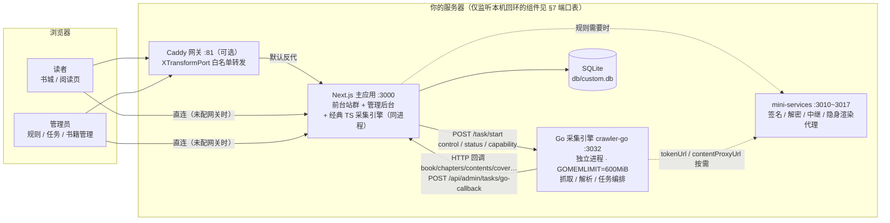
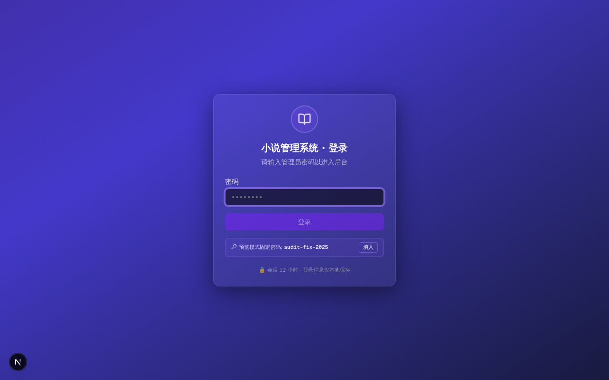
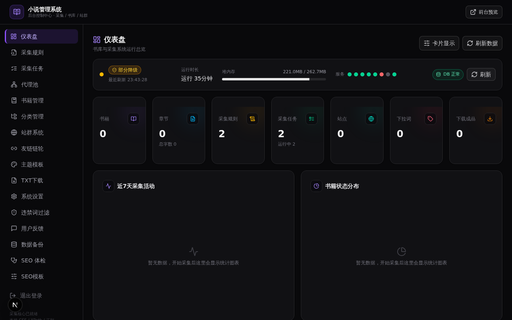
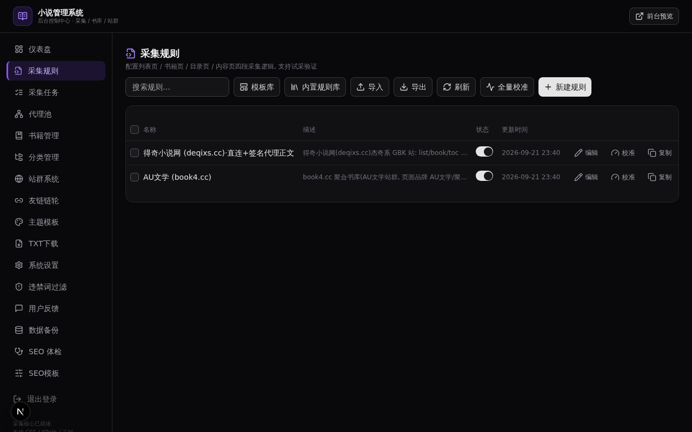
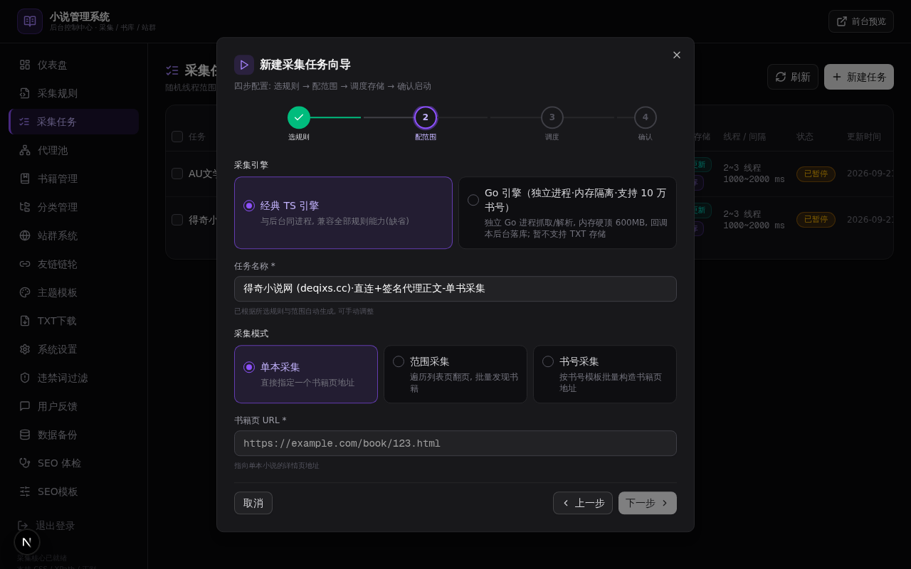
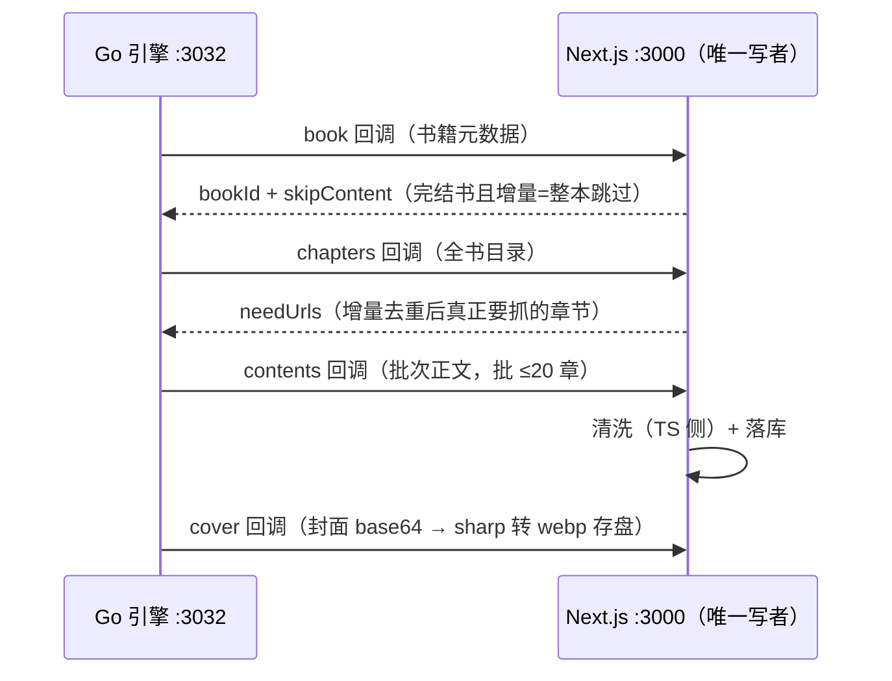
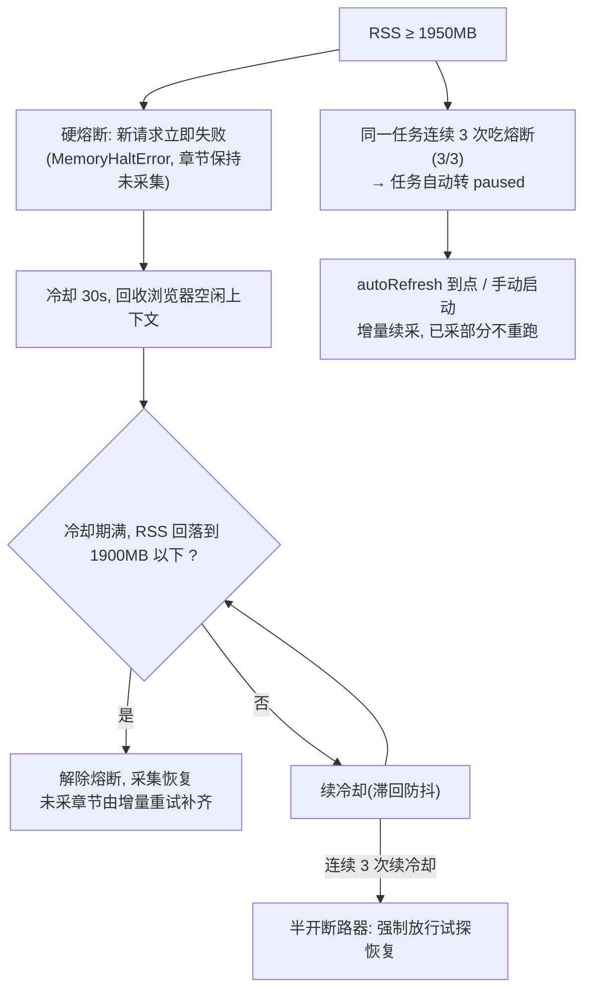
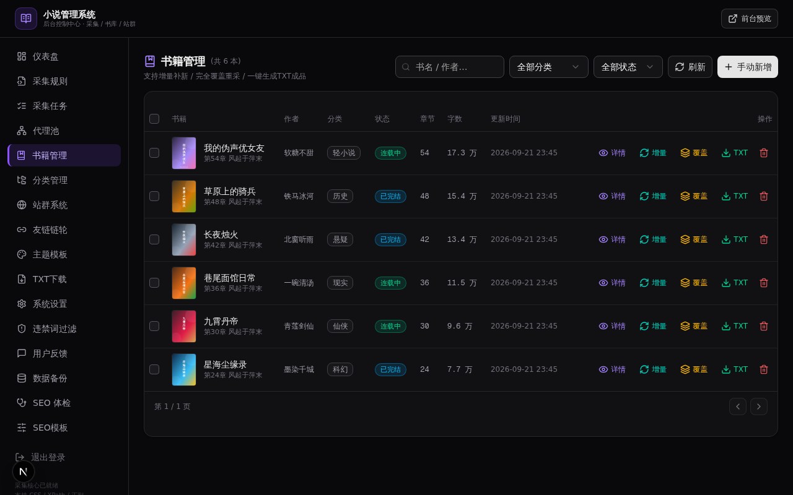
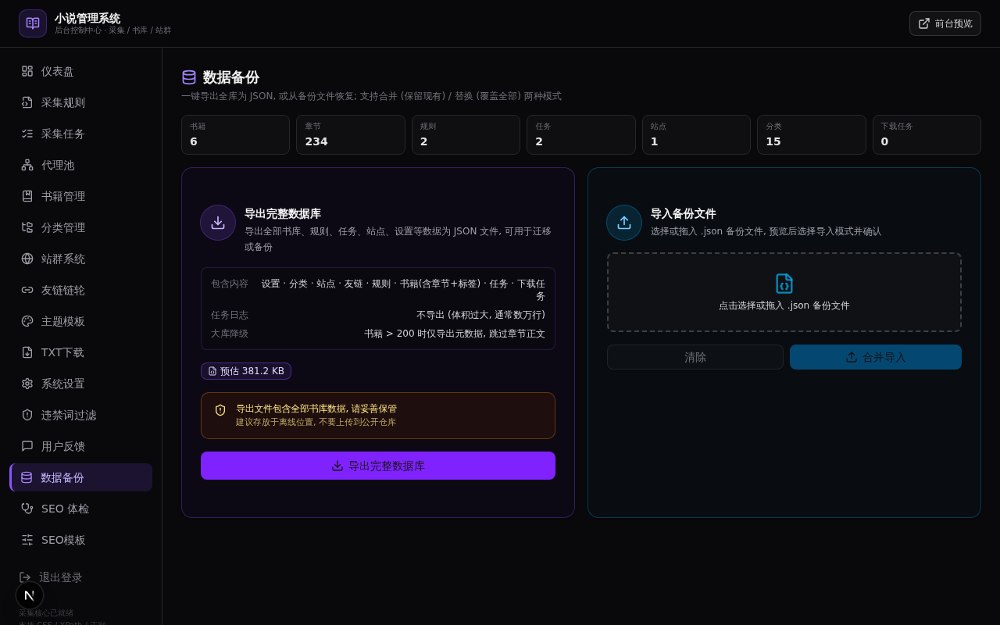

# 小说聚合站 · 安装部署图文教程（R52 重写版）

> **这份教程写给谁**：从没碰过本项目的运维 / 新手开发者，到想把系统稳定跑在生产上的维护者。
> 只需要会一个动作：**复制 → 粘贴 → 回车**；进阶章节（引擎双模 / 内存护栏 / 反反爬开关）则给运维一张"为什么"的地图。
>
> **真实截图**：本文所有截图（`docs/images/r52-*.png`）均为 R52 轮在运行中的站点上以 1280×800 实拍的浏览器截图（数据为 `bun scripts/seed.ts` 演示种子 + 真实采集任务残留），非示意图。界面随版本可能有细微变化，以正文为准。
>
> **核对声明**：文中出现的每条命令、每个环境变量、每个路径均已对照 `package.json`、`.env.example`、`docker-compose.yml`、`docker-entrypoint.sh`、`mini-services/crawler-go/run.sh`、`scripts/install-go.sh` 等仓库实文件逐项核实（R52）。详细生产运维背景另见 [DEPLOY.md](../DEPLOY.md)（部署速查卡），功能总览见 [README.md](../README.md)。

**目录**

- [第 1 章 项目简介与架构（一页看懂）](#第-1-章-项目简介与架构一页看懂)
- [第 2 章 环境要求](#第-2-章-环境要求)
- [第 3 章 快速开始（5 分钟跑起来）](#第-3-章-快速开始5-分钟跑起来)
- [第 4 章 初始化：导入内置规则库](#第-4-章-初始化导入内置规则库)
- [第 5 章 采集引擎双模：经典 TS 引擎 vs Go 引擎](#第-5-章-采集引擎双模经典-ts-引擎-vs-go-引擎)
- [第 6 章 生产部署（Docker 与裸机）](#第-6-章-生产部署docker-与裸机)
- [第 7 章 反向代理与端口约定](#第-7-章-反向代理与端口约定)
- [第 8 章 反反爬环境开关档案](#第-8-章-反反爬环境开关档案)
- [第 9 章 内存护栏：熔断线与自动暂停](#第-9-章-内存护栏熔断线与自动暂停)
- [第 10 章 定时与自动续采（autoRefresh）](#第-10-章-定时与自动续采autorefresh)
- [第 11 章 备份与恢复](#第-11-章-备份与恢复)
- [第 12 章 升级流程](#第-12-章-升级流程)
- [第 13 章 故障排查 FAQ](#第-13-章-故障排查-faq)
- [第 14 章 附录：常用命令速查表](#第-14-章-附录常用命令速查表)

---

## 第 1 章 项目简介与架构（一页看懂）

### 1.1 一句话介绍

**规则驱动的小说采集与发布系统**（Next.js 16 + Bun + Prisma/SQLite，可选 Go 采集引擎）：

- 你在**管理后台**配置「采集规则」（去哪个站抓、怎么找书和章节）与「采集任务」（抓哪些、几点抓、抓多快、用哪个引擎）；
- 采集引擎按规则抓取 → 清洗（广告/违禁词/编码）→ 落入 **SQLite 单文件数据库**；
- **前台站群**（书城 / 书籍详情 / 阅读页 / 搜索，多主题伪静态 + 全链 SEO）直接消费库内数据，读者免登录阅读。

### 1.2 整体架构图



三个关键设计，先建立印象（后文各章展开）：

1. **Next.js 是数据库的唯一写者**：无论 TS 引擎（进程内直接写库）还是 Go 引擎（把抓到的书/章/正文/封面经 HTTP 回调交回 Next.js 落库），持久化与**增量决策**（`skipContent` 跳过完结书、`needUrls` 只采新章）都收敛在主应用一侧——引擎随便崩、随便重启，库里数据与断点不乱。
2. **TS 引擎与主应用同堆运行**（缺省，零配置）；**Go 引擎是独立进程**（端口 3032），采集内存与 Web 进程彻底隔离——这是第 9 章内存护栏的解法。
3. **mini-services 是可选外挂**：29 条内置规则中仅少数签名/解密类站点（笔趣阁 3010 / 七猫 3013 / 得奇 3014 / 新键盘 3015 / 起点 3017）依赖对应代理，主应用不启动它们也能正常跑、正常采集绝大多数站点。

### 1.3 入口速览

| 地址 | 用途 |
| --- | --- |
| `http://localhost:3000/` | 管理后台（仪表盘 / 规则 / 任务 / 书籍 / 备份 …） |
| `http://localhost:3000/?view=home` | 前台站点（书城 / 阅读页 / 搜索） |
| `http://127.0.0.1:3032/health` | Go 引擎健康检查（仅本机） |

---

## 第 2 章 环境要求

| 项 | 要求 | 说明 |
| --- | --- | --- |
| 操作系统 | **Linux 为主**（Ubuntu 22.04+ / Debian 12 等） | 生产推荐；macOS、Windows（WSL2）可用于开发体验 |
| 运行时 | **Bun ≥ 1.3**（必装） | 安装：`curl -fsSL https://bun.sh/install | bash`（国内可 `npm i -g bun` 走 npmmirror） |
| Go 工具链 | **可选**，Go 1.24+（仅 Go 引擎需要） | **一键安装：`bash scripts/install-go.sh`**（装到 `~/go-sdk`，幂等；go.dev 不可达自动回退国内镜像 golang.google.cn）。`go.mod` 要求的更新工具链会在首次构建时自动下载 |
| Docker | 可选（生产推荐） | Docker 20.10+ 含 compose 插件（`docker compose version` 能出版本号） |
| CPU / 磁盘 | 2 核 / 10GB+ | 镜像在部署机现场构建，x86_64 与 arm64 均可 |
| 内存 | **2GB 可运行，4GB 从容** | 口径见下表 |

**内存口径（为什么要关心 Go 引擎）**：

| 场景 | 实测内存 |
| --- | --- |
| dev 模式编译尖峰 | 2.2GB+（Turbopack 稳态基线 ~1.78GB，进程 kill 线 ~2.15GB） |
| 经典 TS 引擎采集（与 dev server 同堆） | RSS 峰值 **~2GB**（实录 2045MB，会触到 1950MB 熔断线，见 §9） |
| **Go 引擎采集**（独立进程） | **RSS ~12MB**（R51 实测 7.7→12MB；`GOMEMLIMIT=600MiB` 软硬顶兜底），可用 `curl http://127.0.0.1:3032/health` 实时查看 `rssMB` |

> 结论：**2GB 小机器跑生产，请优先 Docker（或裸机 `bun run start` 生产模式，基线远低于 dev）+ 大范围采集切 Go 引擎**；dev 模式只适合本地试玩。

---

## 第 3 章 快速开始（5 分钟跑起来）

### 3.1 拿到代码

```bash
git clone https://github.com/u4399com-beep/heis.git novel-system
cd novel-system
# 没有外网 git 条件时：把整个项目目录拷贝到服务器亦可（部署资产都在仓库内）
```

### 3.2 安装依赖

```bash
bun install
```

### 3.3 配置 .env（系统的"设置文件"）

```bash
cp .env.example .env
```

`.env` 中不注释的项是核心常调项，逐个说明（与 `.env.example` 一一对应）：

| 变量 | 默认值 | 说明 |
| --- | --- | --- |
| `DATABASE_URL` | `file:./db/custom.db` | SQLite 库文件路径（相对项目根）。**数据全在这一个文件里，备份它**（见 §11）。Docker 部署由 compose 改写为 `file:/app/db/custom.db` |
| `ADMIN_PASSWORD` | `audit-fix-2025` | 后台登录密码。**生产必改**；留空则回落编译期固定默认密码并在启动日志给 `[auth] ADMIN_PASSWORD 未设置` 警告 |
| `SESSION_SECRET` | 空 → 编译期固定常量 | 登录会话签名密钥。生产建议设独立随机长串（`openssl rand -hex 32`） |
| `LOG_LEVEL` | `info`（dev 为 `debug`） | `debug` / `info` / `warn` / `error` 四档结构化日志 |

注释掉的项全部**可选**、未设时各模块回落缺省值（零回归），分组速览：

| 分组 | 变量 | 何时需要 |
| --- | --- | --- |
| Docker 一键（install.sh 读） | `AUTO_FILL` `AUTO_FILL_RULES` `HOST_PORT` `WAIT_TIMEOUT` `REPO_URL` `INSTALL_DIR` `USE_CN_MIRROR` `REGISTRY_MIRRORS` `SKIP_REGISTRY_MIRROR` | 仅 Docker 部署（§6） |
| Docker 构建参数 | `BUN_IMAGE` `NODE_IMAGE` `PYTHON_IMAGE` `NPM_REGISTRY` `PIP_INDEX_URL` `DEBIAN_MIRROR` `PLAYWRIGHT_DOWNLOAD_HOST` | 国内网络构建加速（§6.8 / §13） |
| 反反爬增强开关 | `RETRY_AFTER_HONOR` `CHALLENGE_ESCALATE` `RESPONSE_SANITY` `FETCH_BINARY_RETRY` `FETCH_BODY_LEN_CHECK` `FETCH_AL_POOL` `HOSTGATE_PACE_PROFILE` `PROXY_HEALTH_SCORING` | 采集被拦时逐档开启（§8 有缺省值与代价表） |
| 渲染链 / 桥地址 | `OBSCURA_CONCURRENCY` `OBSCURA_DEVID` `CLOAK_DEVID` `CLOAK_UA_POOL` `FETCH_RELAY_URL` `SCRAPLING_BRIDGE_URL` | 强 JS/CF 挑战站的隐身渲染调优 |
| 采集引擎（Go） | `GO_ENGINE_URL`（缺省 `http://127.0.0.1:3032`）`GO_CALLBACK_SECRET`（缺省 `go-cb-2025-mhgl`）`GO_PORT` | 多主机分离部署才需要改 |
| 起点中文代理 | `QD_YWKEY` `QD_YWGUID` `QD_UPSTREAM` | 仅起点规则的正文链路（代理进程级变量） |
| 中继桥调优 | `RELAY_MAX_INFLIGHT`（缺省 32） `RELAY_BLOCK_PRIVATE` | fetch-relay 并发上限 / 多主机防 SSRF |
| 多主机闸门 | `BRIDGE_KEY` | mini-services 跨机部署时设共享密钥；单机无需 |

### 3.4 初始化数据库

```bash
bun run db:push        # 等价 prisma db push，幂等
```

执行后应看到：

```
The database is already in sync with the Prisma schema.   # 首次为: 数据库创建成功类提示
Running generate... ✔ Generated Prisma Client (v6.x.x)
```

> 首次执行会自动创建 `db/custom.db` 并建好全部表；重复执行是空操作。**注意**：本仓库的 `bun run db:push` **不带** `--accept-data-loss`——遇破坏性结构变更 prisma 会明确报错并列出将删除的数据，绝不会静默毁库（强制重整方法见 §13 FAQ 11）。

### 3.5 启动

```bash
bun run dev            # 开发模式：端口 3000，日志 tee 进 dev.log
# 或一键带小服务：bash .zscripts/dev.sh（同时拉起 mini-services 下带 dev 脚本的服务，日志见 .zscripts/）
```

看到 `Ready`（或 `Local: http://localhost:3000`）即启动成功。

### 3.6 首次登录后台

浏览器打开 `http://localhost:3000/`：



- **dev / 沙箱模式下**，若生效密码就是公开默认值，登录页会直接显示提示并提供**「填入」**按钮（一键填入 `audit-fix-2025`），点「填入」→「登录」即可；
- 自定义密码（`ADMIN_PASSWORD` 设过）**不会**被回显提示；
- 登录接口内置防爆破：同 IP 60 秒窗口最多 5 次，超限返回 `Retry-After`，稍等再试。

登录后进入仪表盘：



**改密码**：编辑 `.env` 的 `ADMIN_PASSWORD=你的强密码` → 重启进程生效（Docker 路线 compose 会自动透传该变量进容器，改完 `docker compose up -d` 重建，旧会话自动失效）。

### 3.7 看一眼前台

打开 `http://localhost:3000/?view=home`——空库时前台无书。想先看效果：`bun scripts/seed.ts` 写入演示数据（分类 15 / 默认站点 / 示例规则 3 条 / 演示书 6 本，**空库守卫**，库里已有书则自动跳过，可放心执行）。有书后的阅读页长这样：


> ✅ **5 分钟检查点**：能登录后台 + 前台能打开 = 部署成功。接下来两步把它变成"能自动采书的站"：§4 导入规则 → §5 建任务。

---

## 第 4 章 初始化：导入内置规则库

系统自带**实测站点规则库（29 条，`src/lib/crawl/builtin-rules.ts`）**，无需手写任何解析规则。

**入口**：管理后台 → **采集规则** → 工具栏**「内置规则库」**按钮 → 预览清单 → 一键导入。



**API 等价方式**（脚本/自动化场景）：

```bash
# 登录拿到会话 Cookie 后（heis_admin），幂等导入：
curl -X POST http://localhost:3000/api/admin/rules/import-builtin -b "heis_admin=<你的会话>"
```

**幂等语义**：同名规则已存在则跳过，**绝不清空/覆盖你改过的规则**；可重复执行。

> ⚠ 少数站点规则依赖本机 mini-service 代理（如笔趣阁 AES-token→3010、七猫双签名→3013、得奇签名→3014、新键盘解密→3015、起点正文→3017）。依赖缺失时该站任务会失败/降级，其余站点不受影响；代理启动方式见 §7 端口表「启动」列。
>
> ⚠ 采集合规红线：仅采集你有权访问的站点，控制频率（慢速档起步），遵守目标站 robots/服务条款；免责声明见 README。

---

## 第 5 章 采集引擎双模：经典 TS 引擎 vs Go 引擎

### 5.1 为什么有两个引擎

TS 引擎与 Next.js **同堆运行**：dev 模式下 Web 进程基线就有 ~1.7GB，再叠加采集队列/正文缓冲，RSS 峰值实录 **2045MB**，会顶到 1950MB 熔断线（§9），任务频繁自动暂停。**Go 引擎（`mini-services/crawler-go`，端口 3032）把抓取/解析/编排搬进独立 Go 进程**（`GOMEMLIMIT=600MiB` 硬顶），Next.js 只负责落库与增量决策——采集内存占用从 ~2GB 降到 **~12MB**（§2 实测）。TS 引擎原样保留作缺省引擎（`engine='ts'`），零回归。

### 5.2 能力差异表（契约：`agent-ctx/go-engine/CONTRACT.md`）

| 维度 | 经典 TS 引擎（缺省） | Go 引擎 |
| --- | --- | --- |
| 运行位置 | 与后台同进程（dev server / standalone node） | 独立进程 `crawler-go`（127.0.0.1:3032） |
| 内存画像 | 与主应用同堆，采集期 RSS 可达 ~2GB | 独立进程 ~12MB（`GOMEMLIMIT=600MiB` 软顶） |
| 规则四段解析（css/regex/json/const、翻页、GBK 等多 charset） | ✅ 全量 | ✅ 全量（与 TS 语义对齐，含算术占位符 `{var|/N}` fail-closed 预检） |
| `xpath` 字段 | ✅ | ❌（capability 报 unsupported → 自动回退 TS） |
| 浏览器渲染（`engine='browser'`/waitSelector/clickSelector） | ✅ | ❌（同上回退） |
| `fetchMode='scrapling-*'` / `curlImpersonate` / 免费代理池 `needsProxy` | ✅ | ❌（同上回退） |
| 正文 clean（广告清洗/违禁词） | ✅ 进程内 | 解析后原始 HTML 回调，**清洗仍在 TS 侧执行**（效果一致） |
| 反反爬 | 多引擎降级链全量 | 拦截页/挑战壳检测、Retry-After 冷却、镜像 sticky、代理冷却、UA 指纹头组（持续对齐 TS） |
| TXT 存储（storageMode=txt） | ✅ | ❌（选 Go 时自动回退 TS 引擎） |
| 书号采集上限 | **2000** 本 | **100000** 本（10 万） |
| 任务容错 | 熔断/断点续采/暂停续采（§9） | 回调失败重试 3 次（1s/2s/4s）→ 任务自动转 paused；Go 进程重启后任务态丢失，Next.js 重发 start 靠增量决策天然幂等续采 |

**回退规则（零配置兜底）**：建任务/启动时若 Go 引擎**不可达**或规则含其**不支持的能力**，控制面自动回退 TS 引擎并在任务日志记 warn——选了 Go 不会让任务卡死。

### 5.3 在哪选引擎：新建任务向导

管理后台 → **采集任务** → 「新建任务」→ 向导**第 2 步「配范围」顶部即「采集引擎」选择器**：



- **经典 TS 引擎**：与后台同进程，兼容全部规则能力（缺省）；
- **Go 引擎（独立进程·内存隔离·支持 10 万书号）**：选它后"书号范围/列表"输入框的上限文案实时从 2000 → 100000（同口径校验：`bookIdMaxCountForEngine`，三方 UI/API/引擎一致；书号范围 `to-from+1 > 100000` 引擎直接拒绝启动，防误灌）。

> 2000 上限的历史原因：TS 引擎与 dev server 同堆（队列/进度集合常驻堆内有 OOM 史）+ 单任务失控粒度防护；Go 引擎进程隔离后书号模式输入面放开到 10 万。

### 5.4 启动 Go 引擎（两条命令）

```bash
# ① 首次安装 Go 工具链（幂等，已装且版本匹配则跳过）：
bash scripts/install-go.sh
#    → [install-go] 完成。run.sh 会自动把 ~/go-sdk/go/bin 加入 PATH

# ② 启动（崩溃自重启循环；每次启动自动 go build 重编译）：
cd mini-services/crawler-go && bash run.sh
#    等价: bun run dev（package.json 的 dev 脚本就是 bash run.sh）
```

`run.sh` 做了三件事（行为契约）：

1. `export PATH=$HOME/go-sdk/go/bin:$PATH` —— 使用一键安装的 Go；
2. `export GOMEMLIMIT=600MiB` —— Go 运行时软内存顶（配合"每章处理完即弃"的内存策略）；
3. `while true; do go build && 运行; 崩溃 1 秒后自动重启` —— **崩溃自重启**；改了 Go 代码或 `git pull` 升级后，kill 掉旧循环再 `bash run.sh` 即自动重编（§12）。

验证健康：

```bash
curl http://127.0.0.1:3032/health
# {"engine":"go","ok":true,"rssMB":11.96,"tasks":{"paused":0,"running":0},"uptimeMs":…,"version":"1.0.0"}
```

### 5.5 回调链（数据如何安全落库）

Go 引擎抓到的每本书/目录/正文/封面，都经 HTTP 回调交回主应用（`POST /api/admin/tasks/go-callback`，请求头 `x-go-callback-secret` 校验，值取环境变量 `GO_CALLBACK_SECRET`，**两侧缺省固定 `go-cb-2025-mhgl`**）：



语义要点：**回调失败自动重试 3 次（1s/2s/4s）仍败 → 任务转 paused 保留进度**；Go 侧重启不丢数据（重新 start 后 `skipContent`/空 `needUrls` 等价断点续采）；回调按 URL 幂等 upsert，乱序/重放安全。

### 5.6 autoRefresh 与 Go 任务的当前边界（诚实说明）

- Go 任务**完成（done）时**，若开了 autoRefresh，v1 只在任务日志里提示（不自动循环）；
- autoRefresh 定时重开会**经 TS TaskRunner 直启** Go 任务（功能正确，但失去 Go 进程隔离）——长期大任务建议手动增量续跑，或接受该行为（R51 遗留项，后续轮次让 runner 感知 engine）。

---

## 第 6 章 生产部署（Docker 与裸机）

### 6.1 方式选型

| 方式 | 适合谁 | 内存 | 命令 |
| --- | --- | --- | --- |
| **A. Docker 一键**（推荐生产） | 想要开机自启、崩溃拉起、免环境折腾 | 构建 ≥4GB，运行期小 | `bash install.sh` |
| B. Docker 手动 | 想看清每一步 | 同上 | `docker compose up -d --build` |
| C. 裸机 Bun | 已装 Bun、需要 3012/3016/3017 等全套 mini-service 或调试引擎 | 生产运行 2GB 可跑（构建 ≥4GB） | `bun run build && bun run start` |

三种方式**共用同一套数据形态**：SQLite 单文件 `db/custom.db` + `data/` 目录（Docker 下映射为宿主机 `./db`、`./data`）——换部署方式 = 搬这两个目录。

### 6.2 Docker 一键（install.sh）

```bash
git clone https://github.com/u4399com-beep/heis.git novel-system && cd novel-system
bash install.sh
```

脚本自动：检测/安装 Docker（国内多级镜像源自适应）→ 预检 3000 端口 → `docker compose up -d --build` → 轮询健康检查（最长 5 分钟，失败打印日志与中文排查清单）→ 打印访问地址。**重复执行安全（幂等）**：已有容器自动重建，`./db`、`./data` 数据不受影响。

### 6.3 Docker 手动

```bash
cd <项目目录>
sudo mkdir -p ./db ./data && sudo chown -R 1001:1001 ./db ./data   # 非 root 容器（uid 1001）需要属主匹配
docker compose up -d --build
docker compose ps          # STATUS 出现 (healthy) 即就绪，约 40 秒预热
```

compose 服务名 **`novel-system`**，要点（`docker-compose.yml`）：

- 端口 `3000:3000`（宿主机被占改左侧，如 `"8080:3000"`）；
- 数据卷 `./db:/app/db`（SQLite）与 `./data:/app/data`（封面/下载产物）；
- `restart: unless-stopped`（崩溃自动拉起）+ `cap_drop: ALL` + `no-new-privileges` + 非 root（`USER app`, uid 1001）+ 日志轮转 `json-file max-size=20m max-file=5`；
- 健康检查：镜像内 `node fetch http://127.0.0.1:3000/`，`interval 15s / timeout 5s / retries 5 / start_period 40s`；
- 环境变量透传：`ADMIN_PASSWORD` / `SESSION_SECRET` / `AUTO_FILL` / `AUTO_FILL_RULES`（宿主机 `.env` 自动加载）。

### 6.4 容器首启发生了什么（docker-entrypoint.sh）

1. **可写性预检**：`/app/db` 不可写（宿主机目录属主非 uid 1001）→ 日志给出 `sudo chown -R 1001:1001 ./db ./data` 指引；
2. **建目录**：`/app/db`、`/app/data/{covers,novels,downloads}`、`/app/logs`；
3. **幂等 `prisma db push`**：首启建库建表；重启时结构一致则空操作。**刻意不带 `--accept-data-loss`**——冲突性变更时报错但**继续启动**（绝不静默毁数据），日志给中文处理指引；
4. **拉起 5 个共置采集代理**：`bqg713-proxy(3010)` / `fetch-relay(3011)` / `qimao-proxy(3013)` / `deqixs-proxy(3014)` / `xjp-proxy(3015)`（后台启动，失败只警告不阻断主服务）；
5. **自动填充引导**（`AUTO_FILL=1` 时，见 6.5）；
6. **前台启动** `node server.js`，SIGTERM/SIGINT 统一转发给全部子进程（`docker stop` 优雅退出）。

> ⚠ Go 引擎（3032）**不在容器内共置**：纯 Docker 部署下容器内引擎无法访问宿主机回环的 3032。需要 Go 引擎时用裸机路线（C），或在容器内自行安装 Go 并挂载运行 crawler-go。

### 6.5 自动填充：装完即有书（默认开启）

健康检查通过后，容器内 `docker/autofill.mjs` 自动：① 把 7 个实测站点规则**幂等导入**（同名跳过，绝不清空你改过的规则）；② 为每站建「自动填充·」前缀任务并按状态机续跑（pending/paused/stopped/error → start；running/done → 跳过）；③ 完成后每 30 分钟增量续采。首次跑完约 20~40 分钟前台就有真实书籍可读。

```bash
docker compose logs -f | grep 自动填充    # 引导日志（[自动填充] 前缀）
AUTO_FILL=0 bash install.sh               # 关闭自动填充
AUTO_FILL_RULES=fanqie,qimao bash install.sh   # 只填充指定站点
```

站点 key 对照：`fanqie`(番茄) / `qimao`(七猫) / `deqixs`(得奇) / `80ge`(八零) / `jhssd`(精华书阁) / `ttkan`(天天看) / `bqg713`(笔趣阁) 为默认 7 站；`pili`(霹雳书屋，依赖可选 scrapling 桥 `--profile stealthy`) 与 `xjp`(新键盘，6254 章大体量) 默认不参与，需 `AUTO_FILL_RULES=...,pili` 显式启用。

### 6.6 裸机生产（Bun 路线，无 Docker）

以 `package.json` 实际 scripts 为准：

```bash
cd ~/novel-system
bun install            # 依赖（升级后重跑）
bun run db:push        # 建库建表（幂等；不带 --accept-data-loss，升级前先备份 §11）
bun run build          # 生产构建（Turbopack 峰值超 2GB；产出 standalone 并拷入 static/public）
bun run start          # NODE_ENV=production 运行 .next/standalone/server.js，日志 tee 进 server.log
```

生产常驻三选一：

```bash
# ① nohup（最简单）：
nohup bun run start > server.log 2>&1 &
# ② tmux / screen：tmux new -s novel 里跑 bun run start，Ctrl+B D 脱离，tmux attach -t novel 回来
# ③ systemd（开机自启，按实际用户/路径改）：
#    /etc/systemd/system/novel.service → ExecStart=/root/.bun/bin/bun run start
#    WorkingDirectory=/root/novel-system → Restart=on-failure
#    sudo systemctl daemon-reload && sudo systemctl enable --now novel
```

**dev 看门狗（可选，仅 dev 模式）**：`scripts/dev-watchdog.sh`（15 秒 `ss` 探测 3000 端口，仅端口死亡时 `bun run dev` 拉起，日志进 `/tmp/main-dev-restart.log`）与 `.zscripts/dev-watchdog.sh`（30 秒 curl 探测版）二选一：

```bash
nohup bash scripts/dev-watchdog.sh >/dev/null 2>&1 &   # ⚠ 脚本内写死 /home/z/my-project，项目在别处先改路径
```

生产模式的进程守护请优先用 systemd `Restart=on-failure`（或 Docker 的 `restart: unless-stopped`），watchdog 是 dev 期 OOM 自愈的兜底。

### 6.7 mini-services 常驻（裸机路线）

裸机路线下 mini-services 不会自动拉起（`dev.sh`/容器才会）。用到哪个按需启动（目录名=服务名）：

```bash
cd mini-services/bqg713-proxy  && nohup bun run start >/dev/null 2>&1 & cd ../..
# 其余: fetch-relay(3011) qimao-proxy(3013) deqixs-proxy(3014) xjp-proxy(3015) qidian-proxy(3017)
# cloak-browser(3016) 用 bun run dev（需本机 chromium）；scrapling-bridge(3012) 需按其说明装 Python venv
```

### 6.8 Docker 构建（国内网络可选加速）

国内服务器一键脚本默认零配置自适应（Docker 安装源 / 镜像加速器 / 基础镜像站 / 构建期依赖源全自动切换）；手动部署需要时经环境变量覆盖：`USE_CN_MIRROR=1`（强制国内）、`NPM_REGISTRY`（如 `https://registry.npmmirror.com`）、`BUN_IMAGE`/`NODE_IMAGE`（基础镜像直指镜像站，如 `docker.m.daocloud.io/oven/bun:1`）等——全部变量见 `.env.example` 注释。首次构建 3~10 分钟属正常；内存不足 2GB 构建可能被 OOM 杀（日志 `Killed`），加 swap 或换 4GB 机器。

---

## 第 7 章 反向代理与端口约定

### 7.1 端口总表

| 端口 | 服务 | 绑定 | 说明 |
| --- | --- | --- | --- |
| **3000** | Next.js 主应用（后台+前台） | 全部接口 | 对外仅暴露这一个端口即可 |
| **3032** | **Go 采集引擎 crawler-go** | **仅 127.0.0.1**（`GO_PORT` 可覆盖） | **仅内网/本机**——浏览器永不直连，控制面与回调都是服务器内部后端对后端；`GO_ENGINE_URL` 可指向远程（多主机分离才需要） |
| 3010 | bqg713-proxy（AES-token） | 127.0.0.1 | 笔趣阁规则正文链路 |
| 3011 | fetch-relay（TLS 指纹中继） | 127.0.0.1 | 引擎降级链出路 |
| 3012 | scrapling-bridge（Python，可选） | 127.0.0.1 | 强 JS/CF 站备用路径（源码钉死仅绑回环） |
| 3013 | qimao-proxy（双签名+AES） | 127.0.0.1 | 七猫官方 API 规则 |
| 3014 | deqixs-proxy（三参数签名） | 127.0.0.1 | 得奇正文链路 |
| 3015 | xjp-proxy（var c 解密） | 127.0.0.1 | 新键盘正文链路 |
| 3016 | cloak-browser（可选） | 127.0.0.1 | 反检测浏览器（独立增强，未接入自动降级链） |
| 3017 | qidian-proxy（起点正文） | 127.0.0.1 | 仅起点规则正文链路（还需 `QD_YWKEY`/`QD_YWGUID`） |
| 3040 | ratelimit-site（校准模拟源站） | 本地 | 规则极限校准的探测目标，**仅本地测试** |
| 81 | Caddy 网关（可选） | 按需 | 见 7.2 |

> ⚠ 3010~3017 全部只绑 127.0.0.1，**勿映射公网**（fetch-relay / scrapling-bridge 源码层钉死回环）。

### 7.2 Caddyfile XTransformPort 网关（仓库自带）

根目录 `Caddyfile` 监听 **:81**，做两件事：

- **默认**：所有请求反代到 `localhost:3000`（透传 X-Forwarded-For 等标准头）；
- **白名单转发**：URL 带 `?XTransformPort=N` 且 N ∈ {3010, 3011, 3012, 3013, 3014, 3015, 3017} 时反代到对应 mini-service——这是**显式逐端口白名单**（SSRF 防御，R4A-8），杜绝了"任意端口代理"的攻击面。**3032（Go 引擎）刻意不在白名单**：它不经过网关、不对外，后端直连 127.0.0.1（契约 §0）。

```bash
caddy run --config Caddyfile     # http://<IP>:81 即网关入口
```

### 7.3 生产安全建议

- 3000 不要裸奔公网：前置 Nginx/Caddy 做 HTTPS + IP 白名单/Basic Auth，或放内网；
- 后台密码 + `SESSION_SECRET` 必设（§3.3）；登录接口自带 60s 窗 5 次防爆破；
- 例行备份（§11）+ 日志轮转（Docker 已内置，裸机建议 logrotate server.log）。

---

## 第 8 章 反反爬环境开关档案

采集引擎（`src/lib/crawl/fetcher.ts` / `hostgate.ts`）暴露一组 `=1` 开启的环境开关。**下表缺省值直接读自代码（R52 逐项核实）**——注意 `.env.example` 头部"全部缺省关闭"的横幅是历史口径，`RETRY_AFTER_HONOR` 已在 R49-2b-3 改为**缺省开启**（`=0` 显式退出），以本表为准：

| 变量 | 缺省 | 作用 | 开启代价 |
| --- | --- | --- | --- |
| `RETRY_AFTER_HONOR` | **开**（`=0` 关闭） | 尊重 429/503 的 `Retry-After` 头：写入 per-host 限流冷却窗（钳 120s 上限；fetcher 级惩罚窗钳 20s），429/503 后同轮重试未结束前其他并发任务即受保护 | 基本为零（纯减伤） |
| `CHALLENGE_ESCALATE` | 关（`=1` 开） | 响应体命中 CF 挑战页强指纹（cf-chl/turnstile/challenge-platform 等）时跳过 Cookie 重试，直接升级浏览器渲染 | 浏览器渲染资源开销；多敲盾页恶化 IP 信誉的隐患被消除 |
| `RESPONSE_SANITY` | 关（`=1` 开） | 响应体健全性启发：长页无正文（纯 JS 壳/SPA 骨架）与乱码密度异常判为拦截，走降级/浏览器重渲染，防空壳正文入库；JSON API 站自动豁免 | 长页文本扫描的少量 CPU |
| `FETCH_BINARY_RETRY` | 关（`=1` 开） | 封面等二进制资源瞬态失败（网络层/408/5xx）退避 800ms 重试一次 | 极小 |
| `FETCH_BODY_LEN_CHECK` | 关（`=1` 开） | 响应体长度与声明校验（Content-Length 不符/截断检测） | 极小 |
| `FETCH_AL_POOL` | 关（`=1` 开） | Accept-Language 方言池：按 host 确定性抽取 q 权重变体，弱化全局指纹 | 极小 |
| `HOSTGATE_PACE_PROFILE` | 关（`=1` 开） | 请求节奏画像：连续被拦/慢响应时自动放缓 per-host 准入节奏 | 采集速度下降（换稳定性） |
| `PROXY_HEALTH_SCORING` | 关（`=1` 开） | 代理池健康评分：按历史成败/延迟加权抽样（缺省纯随机） | 需已配置出口代理池才有意义 |

**建议档位**：默认全关即可跑大多数站点；被 429/限流困扰 → 开 `RETRY_AFTER_HONOR`（缺省已开）+ `HOSTGATE_PACE_PROFILE`；遇到 CF 盾 → `CHALLENGE_ESCALATE`；采到空壳正文 → `RESPONSE_SANITY`。逐档开启观察，不要一次全开。

> 另有一组内存护栏变量（`FETCH_RSS_HALT_MB` 等）在 §9 单独成表。

---

## 第 9 章 内存护栏：熔断线与自动暂停

### 9.1 四条水位线（缺省值实测校准，env 可调）

| 变量 | 缺省 | 含义 |
| --- | --- | --- |
| `FETCH_RSS_SOFT_MB` | 1550 | **软水位**：RSS 进入软~硬区间时，内存感知自动降并发（`FETCH_CONCURRENCY_AUTO` 缺省开）线性收紧有效并发至 ≥1/4（下限 2） |
| `FETCH_RSS_HALT_MB` | **1950** | **硬熔断线**：触发即快速失败（抛 `MemoryHaltError`）+ 立即回收 Obscura 空闲浏览器上下文 + 进入冷却。显式 `≤0` 禁用；正值下限 512 |
| `FETCH_RSS_RESUME_MB` | 1900（=halt−50） | **恢复水位**：冷却期满且 RSS 回落到此线以下才解除熔断（50MB 滞回带防抖动） |
| `FETCH_RSS_STOP_MB` | 2100 | 旧 stop 层高水位兜底（仅 halt 被显式禁用时可触达；halt 缺省 1950 的依据 = kill 线 ~2.15GB 之下留 200MB 刹车距离） |
| `FETCH_RSS_HALT_COOLDOWN_MS` | 30000 | 熔断冷却窗（钳 5s~5min） |
| `FETCH_RSS_PAUSE_MS` | 8000 | 软水位背压单次暂停时长（钳 0.5s~60s） |

> 缺省依据（fetcher.ts 注释原文口径）：dev 模式 Turbopack 稳态基线 ~1.78GB，距实测 kill 线 2.15GB 只有 ~370MB 采集增量预算 → halt 1950 留 200MB 刹车距离，resume 1900 必须高于基线否则熔断后永不解除。**生产 build 基线低得多，可用 env 收得更紧。**

### 9.2 触发后发生了什么（行为时间线）



三个容易困惑的点：

1. **为什么用"快速失败"而不是"等着"**：RSS 只涨不降时，等待=持槽占位继续堆积，与 OOM 赛跑必输；失败让 runner 跳过该页/章（**保持未采集状态**），熔断解除后增量重采可恢复，绝不写半截数据。
2. **"熔断 3/3 自动暂停"**：连续 3 个列表页/书籍/章节吃 MemoryHaltError → 任务转 `paused`（不是 error）——替代"逐页空转烧完余页"，转 paused 后等恢复水位自动续采（autoRefresh）或手动点「启动」即可。
3. **半开断路器**：若你把 halt 配到了进程基线以下（纯滞回会永久饿死采集），连续 3 次续冷却后强制放行——采集以低占空比推进而非完全停摆；RSS 若真又涨到熔断线会再次熔断重新计数。

### 9.3 治本方案：大范围采集切 Go 引擎

TS 护栏是"同堆时代的止血带"。**书号/范围大任务直接在向导里选 Go 引擎**（§5）：采集内存搬进独立进程（~12MB），Next.js 进程回到纯 Web 负载，熔断线基本不再触达。


---

## 第 10 章 定时与自动续采（autoRefresh）

任务向导**第 3 步「调度」**里：

- **autoRefresh 开关**（缺省关）：勾选后任务进入终态（`done`/`error`）时，定时器在 `refreshIntervalMin` 分钟后自动**重新采集**——配合**增量重采**（缺省 `incremental`：已采章节跳过、连载书只补新章），形成"每 N 分钟自动追更"；
- **间隔**：默认 30 分钟，可填 **5 ~ 1440**（分钟，超出范围向导拒绝提交）；
- **重启自愈**：进程重启时 `running` 任务被回收为 `paused`（不丢进度，孤儿恢复机制接管），autoRefresh 任务的定时刷新由重启恢复逻辑重新排定；
- **防硬敲**：熔断后 60s 冷却期内 autoRefresh 的重启请求会被拒绝（提示"熔断冷却中"），冷却过后自动放行——站点改版/被封时系统自愈节奏为 2~3 轮熔断 → paused → 等下一轮，不会无限硬敲故障源；
- **Docker 自动填充任务**（§6.5）默认即 autoRefresh 每 30 分钟增量续采。

---

## 第 11 章 备份与恢复

### 11.1 要备份什么

| 数据 | 位置 | 说明 |
| --- | --- | --- |
| **业务数据库** | `db/custom.db`（SQLite 单文件） | 书/章/规则/任务/设置全部在此；Docker 下= 宿主机 `./db/` |
| **封面** | `data/covers/*.webp` | 采集封面经 sharp 转 webp 落盘；Docker 下= `./data/covers/` |
| TXT 下载产物 | `data/novels/`、`data/downloads/` | 再生型数据，可选备份 |

书籍资产的后台视图（书籍管理，本文截图时库内为 6 本演示书）：



### 11.2 方式①：后台一键（管理 API）

管理后台 → **数据备份**：



- **导出**：JSON 全量快照（后台页面调用的管理 API 为 `POST /api/admin/backup`，恢复为 `/api/admin/backup/restore`）；
- ⚠ **大库降级阈值 = 200 本**（常量 `BACKUP_BIG_BOOKS_THRESHOLD`）：书籍超 200 本时导出自动降级为**仅书籍元数据**（不含章节正文），界面亮「大库模式」徽标——防止数百 MB JSON 撑爆内存。大库请用方式②。

### 11.3 方式②：文件级（最彻底，推荐例行化）

```bash
# Docker 路线：
docker compose down                     # 先停服，保证 SQLite 落盘一致（裸机则 kill 进程）
cp -r db data /你的备份路径/$(date +%F)/  # 整体拷走
docker compose up -d                    # 再启动
# 恢复：目录放回原位再启动；Docker 用户记得属主：sudo chown -R 1001:1001 ./db ./data
```

---

## 第 12 章 升级流程

### 12.1 裸机（Bun）路线

```bash
cd ~/novel-system
# 0) 先备份（§11.3）
git pull
bun install                  # 依赖有变时生效
bun run db:push              # 幂等结构同步（不带 --accept-data-loss；冲突性变更见 §13 FAQ 11）
# 1) 重启主进程：systemd → systemctl restart novel；nohup → kill 旧 PID 后重跑 bun run start
# 2) 升级 Go 引擎（如在使用）：
#    kill 掉 crawler-go 的 run.sh 循环 → cd mini-services/crawler-go && bash run.sh
#    （run.sh 每次启动都自动 go build —— 重启即重编，无需手动编译）
# 3) 重启手动拉起的 mini-services 代理
```

### 12.2 Docker 路线

```bash
cd ~/novel-system && git pull && bash install.sh    # 幂等重建，./db ./data 数据不受影响
# 等价: docker compose up -d --build
```

容器首启 entrypoint 自动做幂等 `prisma db push`（**刻意不带** `--accept-data-loss`，绝不静默毁数据）；遇冲突性变更见 §13 FAQ 11。

### 12.3 回滚

```bash
git checkout <旧commit>     # 之后按同流程重建（bun install / db:push / 重启 或 compose 重建）
# 数据目录不动；若新版本已做破坏性结构变更，用升级前的备份（§11.3）恢复 db/
```

---

## 第 13 章 故障排查 FAQ

**1. 启动报 `EADDRINUSE`（端口 3000 被占，dev.log 里也见过历史残留）**
典型原因：**重复 dev**——上一次 `bun run dev` 没退干净（或 watchdog 已拉起一份），又手动起了一份。
排查与处理：

```bash
ss -ltnp | grep 3000          # 或 lsof -i :3000，找到占用 PID
kill <PID>                    # 杀掉旧实例后重启
```

> dev.log 里偶见的 `EADDRINUSE` 若时间戳久远，多为历史噪声，不代表当前服务异常（以 `curl -I http://127.0.0.1:3000/` 返回 200 为准）。

**2. 任务日志大量 `curl 进程异常退出(code=28)` / timeout**
这是 curl 轨的**超时**错误：源站慢或对你限速。引擎已内置自愈：403/429/503 惩罚记忆（429 优先尊重 `Retry-After`，其余指数退避 1.5s×2ⁿ 钳 20s，带抖动）；代理池失败冷却 30s×2ⁿ 钳 300s；配置了 `mirrorDomains` 的规则自动**镜像切换**（成功域 sticky 置顶，整组耗尽才清）。你能做的：任务节奏放慢（线程↓间隔↑）、给规则配出口代理、或换镜像域名。

**3. 任务状态变 paused，日志见「内存硬熔断 3/3」**
即 §9.2 的**熔断 3/3 自动暂停**（dev 模式大任务常态）。处理优先级：① 等自动——autoRefresh 到点增量续采；② 手动点「启动」续跑（已采部分不重跑）；③ **治本——切 Go 引擎**（采集内存 ~12MB，熔断不再触达）；④ 生产 build 基线低，也可用 `FETCH_RSS_HALT_MB` 收紧护栏。

**4. 封面全是同一张"默认图"（占位图陷阱）**
某些源站对**任意**封面 URL 恒回 `200 + 默认占位图`——HTTP 层完全合法，引擎如实落盘，结果是全站书共享一张图。对策：① 规则「书籍段」封面字段先用**四段测试面板**复验（多试几本书，看解析出的 coverUrl 是否真图）；② 书籍管理里发现雷同封面 → 修正字段表达式后增量重采；③ 半残占位符 URL（如 `bookimg//.jpg`）如今会被算术占位符预检 **fail-closed 拦截**（字段整体置空，宁缺勿假——R49-9 教训），若你看到大量空封面+占位图并存，多半是源站恒回占位图而非规则残缺；④ 清空封面字段即可回退前台主题的渐变占位封面（视觉可接受）。

**5. Go 引擎构建报模块下载失败（`go build` 卡在 download / dial tcp 超时）**
Go 模块/工具链经 `GOPROXY`（缺省 `https://proxy.golang.org,direct`）拉取，国内服务器直连易失败：

```bash
export GOPROXY=https://goproxy.cn,direct    # 国内镜像（写进 run.sh 前两行亦可）
cd mini-services/crawler-go && bash run.sh
```

**6. 沙箱/环境重置后 Go 引擎没了（`go: command not found`）**
沙箱重置会清空 `$HOME`（含 `~/go-sdk`）。**一键恢复：`bash scripts/install-go.sh`**（幂等：已装且版本匹配则跳过；go.dev 不可达自动回退 golang.google.cn）。装完直接 `bash run.sh`——脚本自己会把 `~/go-sdk/go/bin` 加进 PATH。

**7. 登录不上后台**
密码三选一：`.env` 的 `ADMIN_PASSWORD`；未设置时回落默认 `audit-fix-2025`（dev 登录页有「填入」按钮）；改密码后**必须重启进程**。连错多次触发 60s 窗 5 次防爆破 → 等 `Retry-After` 指示的时间再试。Docker 路线确认宿主机 `.env` 有该变量（compose 自动透传，改完 `docker compose up -d` 重建）。

**8. 任务跑完采到 0 本**
按序查：① 规则是否启用、任务规则选对；② 任务范围/书号模板是否渲染出真实 URL（任务日志前几行有"模板解析完成，共 N 本待采集"）；③ 该站规则是否依赖 mini-service 代理（§4 警示框清单）——代理没起则签名/解密类站点失败；④ 日志若见 blocked/429 → §8 开对应开关并放慢节奏；⑤ 用规则行的「测试」面板对列表段做单页解析验证。

**9. 进程被杀（dmesg 见 global_oom / 构建日志 `Killed`）**
内存不足。三招：① 加 swap（`fallocate -l 4G /swapfile` 标准流程）；② 生产模式跑（`bun run start` 基线远低于 dev）；③ 大任务切 Go 引擎。Docker 构建 OOM → 换 4GB 机器或加 swap 后重跑 `bash install.sh`。

**10. 章节正文乱码**
源站编码识别由引擎自动处理（UTF-8/GBK/GB18030/Big5 等，TS 用 iconv-lite、Go 用 golang.org/x/text 双侧一致）。仍乱码时：确认规则是否漏写 charset 字段；`RESPONSE_SANITY=1` 开启后乱码密度异常页会走浏览器重渲染自愈（§8）。

**11. 日志出现 `[警告] 数据库结构同步失败`**
升级后 schema 有**会波及旧数据**的冲突性变更，entrypoint/`db:push` 拒绝静默毁库。处理：

```bash
# 0) 先备份！  1) 明确确认可以删数据后，手动强制同步：
docker compose down
cp -r db db.bak.$(date +%F)
docker compose run --rm --entrypoint node novel-system \
  node node_modules/prisma/build/index.js db push --schema prisma/schema.prisma --accept-data-loss
docker compose up -d
# 裸机路线等价: bun run db:push --accept-data-loss（务必先备份）
```

另确认宿主机 `./db` 属主是 uid 1001（`sudo chown -R 1001:1001 ./db ./data`），否则 prisma 会报 `SQLITE_READONLY`——错误形态与结构变更不同，别混淆。

---

## 第 14 章 附录：常用命令速查表

**开发 / 裸机（package.json scripts）**

| 命令 | 作用 |
| --- | --- |
| `bun install` | 安装依赖 |
| `bun run dev` | 开发模式启动（端口 3000，日志 tee 进 dev.log） |
| `bash .zscripts/dev.sh` | 一键启动（主应用 + mini-services 带 dev 脚本的服务） |
| `bun run build` | 生产构建（standalone，Turbopack 峰值 >2GB） |
| `bun run start` | 生产启动（NODE_ENV=production，日志 tee 进 server.log） |
| `bun run db:push` | 幂等同步数据库结构（不带 --accept-data-loss） |
| `bun run db:generate` / `db:migrate` | 生成 Prisma Client / 迁移 |
| `bun run db:reset` | ⚠ 清空重建数据库（危险，生产禁用） |
| `bun run lint` ＋ `bunx tsc --noEmit` | 质量门（0 错 0 警 / 零类型错误） |

**Go 引擎**

| 命令 | 作用 |
| --- | --- |
| `bash scripts/install-go.sh` | 一键安装 Go 工具链到 ~/go-sdk（幂等，沙箱重置后恢复用） |
| `cd mini-services/crawler-go && bash run.sh` | 启动 Go 引擎（自动重编 + 崩溃自重启；等价 `bun run dev`） |
| `curl http://127.0.0.1:3032/health` | 健康检查（rssMB / tasks / version） |
| `export GOPROXY=https://goproxy.cn,direct` | 国内模块源（构建失败时） |

**Docker**

| 命令 | 作用 |
| --- | --- |
| `bash install.sh` | 一键安装（幂等） |
| `docker compose up -d --build` | 构建并后台启动 |
| `docker compose ps` | 健康状态（(healthy) 即就绪） |
| `docker compose logs -f` | 跟踪日志（`grep 自动填充` 看引导） |
| `docker compose restart` / `down` | 重启 / 停止并删容器（数据保留） |
| `sudo chown -R 1001:1001 ./db ./data` | 非 root 容器属主修正 |

**工具 / 诊断**

| 命令 | 作用 |
| --- | --- |
| `bun scripts/seed.ts` | 演示数据种子（空库守卫，可重复执行） |
| `bun scripts/ratelimit-site.ts --port 3040 --profile standard` | 校准用模拟源站（lenient/standard/strict） |
| `nohup bash scripts/dev-watchdog.sh &` | dev OOM 自愈守护（15s 端口探测；脚本内写死项目路径） |
| `ss -ltnp \| grep 3000` | 查端口占用（EADDRINUSE 排查） |
| `caddy run --config Caddyfile` | 启动 :81 网关（XTransformPort 白名单转发） |

---

> **文档维护说明**：本教程由 R52 轮全面重写（架构图含 Go 引擎 3032 与回调链、截图全部换为运行站实拍）。核对的权威来源：`package.json` / `.env.example` / `docker-compose.yml` / `docker-entrypoint.sh` / `docker/autofill.mjs` / `mini-services/crawler-go/{run.sh,package.json,go.mod}` / `scripts/install-go.sh` / `scripts/dev-watchdog.sh` / `agent-ctx/go-engine/CONTRACT.md` / `src/lib/crawl/{fetcher.ts,runner.ts,go-engine.ts}` / `src/lib/book-ids.ts` / `src/lib/backup.ts` / `Caddyfile`。数字口径（1950/1900/1550/2100、3/3、200/100000、29 条、RSS ~12MB 等）均可在上述文件中 rg 复核。
